# 东软智慧云脑诊疗平台 — 系统设计文档

---

**版本**：v3.0
**日期**：2026-06-21
**关联文档**：[PRD v1.2](./PRD-东软智慧云脑诊疗平台.md) | [需求.md](../docxs/需求.md) | [架构级 OOD 迭代升级设计 v7](../docs/a_v7_design_v1.md)

**v3.0 变更说明**（基于架构级 OOD v7 design v1 全面升级）：

- **闭环状态机**：新增完整 `RegistrationStatus` 状态机（WAITING → IN_CONSULTATION → MEDICAL_RECORD_SAVED → PRESCRIPTION_REVIEWED → PRESCRIPTION_SUBMITTED → COMPLETED / CANCELLED），修正"保存病历即完成挂号"的语义冲突
- **E03 看板双视角**：补全医生端/管理端双视角消费契约，明确 6 类看板 API 与 VO 定义
- **E09 微服务接口**：补全四类 AI 微服务内部接口矩阵、DTO、统一错误响应、traceId、内部鉴权
- **三端读侧 VO**：补全管理端三类 AI 记录、患者端病历/处方、医生端历史处方/审核记录的读侧 VO 契约
- **处方规则依据**：新增 `RuleBasis` 值对象、内置演示规则落点与管理端展示策略
- **AI 配置与审计**：`AIConfig` 聚合设计、`SecretCipher` 加密、`AIProviderResolver`、`AICallRecord` 审计分离
- **并发设计**：号源并发扣减、快照哈希绑定、版本化配置
- **新增章节**：设计决策（12 条）、错误处理策略、并发设计

**v2.0 变更说明**（已被 v3.0 覆盖）：

- 修复全部 22 张 Mermaid 图渲染问题
- 新增第 6 模块覆盖 P1 进阶能力
- 补充 F10-F11 医生列表/详情公开 API
- ER 图移除未定义的 AuditLog

---

## 目录

- [1. 系统概述](#1-系统概述)
- [2. 系统架构设计](#2-系统架构设计)
  - [2.1 系统上下文架构](#21-系统上下文架构)
  - [2.2 技术架构全景](#22-技术架构全景)
  - [2.3 前端架构设计](#23-前端架构设计)
  - [2.4 后端分层架构](#24-后端分层架构)
  - [2.5 项目源码结构](#25-项目源码结构)
- [3. 功能模块分解](#3-功能模块分解)
  - [3.1 模块总览](#31-模块总览)
  - [3.2 模块职责矩阵](#32-模块职责矩阵)
  - [3.3 模块依赖关系](#33-模块依赖关系)
- [4. 数据库设计](#4-数据库设计)
  - [4.1 实体关系总览 ER 图](#41-实体关系总览-er-图)
  - [4.2 核心表结构设计](#42-核心表结构设计)
- [5. 核心模块详细设计](#5-核心模块详细设计)
  - [5.1 模块一：智能分诊与挂号模块](#51-模块一智能分诊与挂号模块)
  - [5.2 模块二：AI 病历生成模块](#52-模块二ai-病历生成模块)
  - [5.3 模块三：处方审核与开具模块](#53-模块三处方审核与开具模块)
  - [5.4 模块四：管理端基础数据模块](#54-模块四管理端基础数据模块)
  - [5.5 模块五：用户认证与通用基础设施模块](#55-模块五用户认证与通用基础设施模块)
  - [5.6 模块六：P1 进阶能力模块](#56-模块六p1-进阶能力模块)
- [6. API 接口总览](#6-api-接口总览)
- [7. AI 服务集成设计](#7-ai-服务集成设计)
  - [7.1 AI Provider 抽象层](#71-ai-provider-抽象层)
  - [7.2 处方审核双引擎架构](#72-处方审核双引擎架构)
  - [7.3 E09 微服务接口矩阵](#73-e09-微服务接口矩阵)
- [8. 安全设计](#8-安全设计)
- [9. 并发设计](#9-并发设计)
- [10. 错误处理策略](#10-错误处理策略)
- [11. 设计决策](#11-设计决策)
- [附录：前端 TypeScript 类型同步清单](#附录前端-typescript-类型同步清单)

---

## 1. 系统概述

东软智慧云脑诊疗平台是一套基于 Spring Boot 3 + Vue 3 + TypeScript 前后端分离架构的**三端智能门诊诊疗原型系统**，面向高校软件工程实训课程。系统覆盖患者端（手机窗口式）、医生端（PC 工作台）、管理端（PC 后台），融合 AI 大模型与本地处方规则引擎，实现"诊前分诊 → 线上挂号 → 医生接诊 → AI 辅助病历生成 → 医生确认保存病历 → 处方开具 → 本地规则审核 + 大模型解释 → 处方提交 → 就诊完成 → 患者评价 → 数据追溯"的完整诊疗闭环。

平台定位为教学实训与课程答辩演示用的**三端智能门诊原型系统**，不承担真实医疗诊断、治疗或处方责任。

**P0 必须稳定跑通的主链路**：管理员维护科室、医生、排班号源、药品、处方规则和 AI 配置；患者注册登录、输入症状、获得分诊推荐、选择号源并挂号；医生查看本人队列、开始接诊、录入问诊、生成并确认病历、审核并提交处方；患者查看自己的病历和处方；管理员追溯 AI 分诊、病历生成和处方审核记录。

**PRD 中所有拓展需求都纳入设计**。P1/P2 只影响交付批次和是否阻塞 P0 验收，不代表可以在 OOD 中缺席。E01 AI 诊疗建议、E02 就诊评价、E03 数据看板、E04 WebSocket 告警、E05 SSE 流式输出、E06 Pinia 状态机、E07 Prompt 模板、E08 Nginx + Jar 双端部署、E09 Spring Cloud 微服务拆分、E10 远期 HIS 边界均必须有模块归属、核心对象/接口、协作契约、接口/数据落点、异常和边界策略。

**核心架构决策**：

- 后端采用**模块化单体**作为 P0 基线，通过任务端口和适配器预留 E09 微服务拆分
- 前端三端保持职责隔离，共享 Axios、JWT 拦截、TypeScript 类型
- `Registration` 作为诊疗闭环锚点，用**闭合状态机**替代含混的"完成"语义：保存病历只推进到 `MEDICAL_RECORD_SAVED`，就诊完成由处方提交后自动完成或医生结束就诊触发
- AI 能力封装为独立 Service + 任务级端口（`*AIClientPort`），支持多供应商切换和后续微服务拆分
- 处方审核采用"**本地规则优先 + 大模型解释**"架构：本地规则引擎先确定风险等级，LLM 只负责解释和补充建议；规则不可用不得伪装低风险
- 读侧 VO 作为架构契约，不拼字符串绕过权限
- AI 调用审计记录（`AICallRecord`）与业务记录（`TriageRecord`、`MedicalRecord`、`PrescriptionReview`）分离

**设计目标**：

- 前后端分离，RESTful API + JWT 认证
- 后端分层：Controller → Application Service → Domain Object → Repository → Gateway/Adapter
- AI 能力通过任务端口隔离，支持本地适配器或 E09 远程适配器
- 处方审核采用"本地规则优先 + 大模型解释"架构（本地规则不依赖 LLM，LLM 不可用不阻断审核）
- 三端共享同一后端 API，通过 `ActorContext` + `RolePolicy` 鉴权区分权限
- P0 核心模块 5 个 + P1 进阶模块 1 个（承载 E01-E10），共 6 个功能模块

---

## 2. 系统架构设计

### 2.1 系统上下文架构

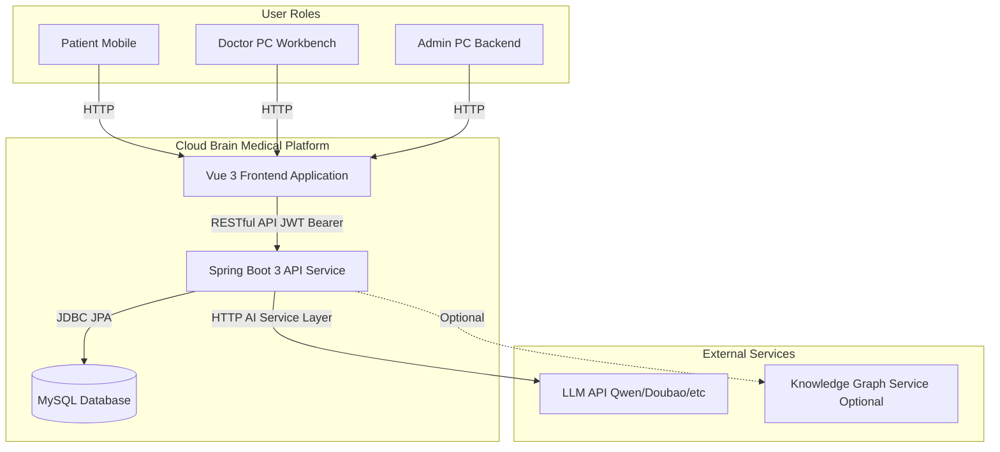

### 2.2 技术架构全景

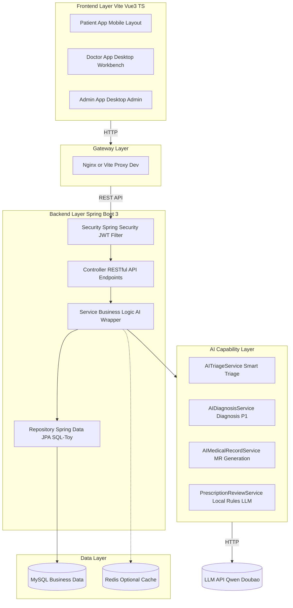

### 2.3 前端架构设计

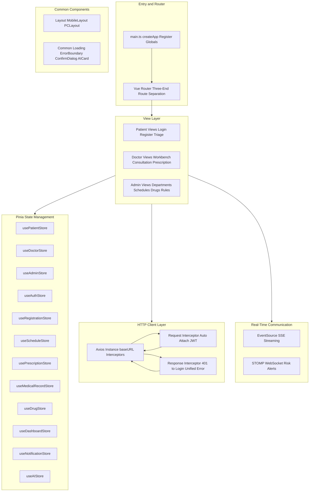

**Pinia Store 设计规范**：每个 Store 必须有 loading、error、degraded、lastLoadedAt 等价状态；所有 Store 只维护前端交互状态和后端 VO 缓存，不承担权威业务状态推进；不得绕过服务端状态推进。关键枚举来自后端类型契约，不使用松散字符串。

三端路由设计：

| 端     | 路由前缀      | 示例                                                                              |
| ------ | ------------- | --------------------------------------------------------------------------------- |
| 患者端 | `/patient/` | `/patient/login`、`/patient/triage`、`/patient/registrations`               |
| 医生端 | `/doctor/`  | `/doctor/workbench`、`/doctor/consultation/:id`、`/doctor/prescription/:id` |
| 管理端 | `/admin/`   | `/admin/departments`、`/admin/schedules`、`/admin/drugs`                    |

### 2.4 后端分层架构

后端采用**模块化单体**作为 P0 基线，保留 Controller、Application Service、Domain Object、Repository、Gateway/Adapter 分层。Controller 是 HTTP 适配层，只做参数形态校验、鉴权入口和统一响应转换；Application Service 是用例编排层，负责事务边界、权限校验、状态推进和跨模块协作；Domain Object 表达挂号、病历、处方、审核、规则、AI 配置等业务不变量；Repository 封装持久化；Gateway/Adapter 隔离外部 AI、远期 HIS、微服务远程调用和基础设施细节。

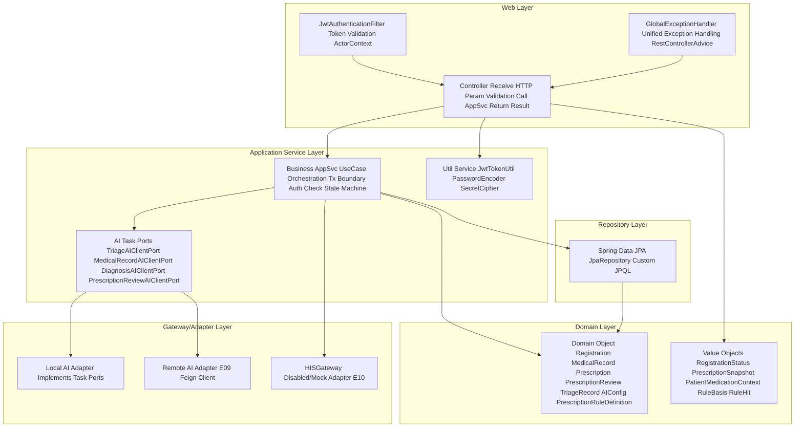

**关键架构抽象**：

- `ActorContext`：当前操作者值对象，封装账号、角色、患者/医生/管理员业务身份和可访问范围。所有业务模块通过 `ActorContext` 判断权限，不信任前端传入的 `patientId` 或 `doctorId`
- `RolePolicy`：基于角色的访问控制接口，判断"谁能查看、开始接诊、保存病历、审核处方、提交处方、查看追溯、接收告警、提交评价"
- `RegistrationLifecyclePolicy`：挂号状态推进的策略服务，提供状态条件更新、幂等和并发控制

统一响应结构 `Result`（泛型 `<T>`）：

```java
public class Result<T> {
    private int code;        // 200 success, 4xx client error, 5xx server error
    private String message;
    private T data;
    private long timestamp;
}
```

### 2.5 项目源码结构

```
cloud-brain-medical/
├── backend/
│   ├── pom.xml
│   └── src/main/java/com/cloudbrain/
│       ├── config/                   # SecurityConfig CorsConfig Knife4jConfig AIConfig WebSocketConfig
│       ├── security/                 # JwtTokenUtil JwtAuthenticationFilter ActorContext RolePolicy
│       ├── common/                   # Result ResultEnvelope GlobalExceptionHandler BaseEntity
│       ├── controller/
│       │   ├── patient/              # Patient public controllers
│       │   ├── doctor/               # Doctor controllers
│       │   └── admin/                # Admin controllers
│       ├── service/
│       │   ├── application/          # Application Services (use case orchestration)
│       │   ├── domain/               # Domain Services (registration lifecycle, rule engine)
│       │   └── ai/                   # AI capability services + task ports + adapters
│       ├── repository/               # JPA repositories
│       ├── entity/                   # JPA entities / domain objects
│       ├── dto/                      # Request/Response DTOs and VOs
│       ├── enums/                    # Enumerations
│       └── gateway/                  # HISGateway RemoteAIServiceAdapter (E09/E10)
├── frontend/
│   ├── package.json
│   ├── vite.config.ts
│   └── src/
│       ├── api/                      # Axios API wrappers
│       ├── router/                   # Vue Router config
│       ├── stores/                   # Pinia stores (10+ stores)
│       ├── views/
│       │   ├── patient/              # Patient pages
│       │   ├── doctor/               # Doctor pages
│       │   └── admin/                # Admin pages
│       ├── components/               # Shared components
│       ├── composables/              # SSE EventSource WebSocket composables
│       └── types/                    # TypeScript type definitions (api.ts enums.ts)
└── docs/                             # Project documentation
```

---

## 3. 功能模块分解

### 3.1 模块总览

本系统划分为 **6 个功能模块**。其中模块一至五对应 P0 核心交付，模块六覆盖 P1 进阶能力。

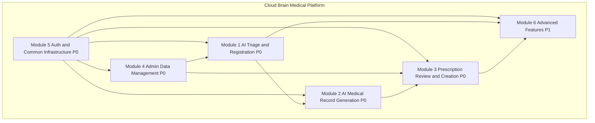

### 3.2 模块职责矩阵

| 模块                                 | 负责人   | 主要职责                                                                                         | 包含 PRD 功能编号 | P0 接口 |
| ------------------------------------ | -------- | ------------------------------------------------------------------------------------------------ | ----------------- | ------- |
| **模块一：智能分诊与挂号**     | 成员 A   | AI 分诊、公开科室/医生查询、排班号源查询、挂号创建与取消、分诊记录持久化、挂号状态管理              | F10-F19, F22      | 10 个   |
| **模块二：AI 病历生成**        | 成员 B   | 医生工作台患者队列、开始接诊、问诊录入、AI 病历草稿生成、病历编辑确认保存（推进到 MEDICAL_RECORD_SAVED）、病历列表查询 | F31-F35           | 8 个    |
| **模块三：处方审核与开具**     | 成员 C   | 药品搜索、处方草稿、本地规则引擎审核、大模型解释、审核记录、处方提交（绑定审核记录）、就诊完成推进  | F23, F25-F30      | 9 个    |
| **模块四：管理端基础数据**     | 成员 D   | 科室/医生管理、排班号源批量管理、药品库 CRUD、处方规则定义 CRUD（含依据结构）、AI 配置管理、AI 调用记录查看、Prompt 模板管理 | F20-F24, E07      | 20+ 个  |
| **模块五：认证与通用基础设施** | 成员 E   | JWT 认证、三端登录注册、`ActorContext` 与 `RolePolicy`、统一响应结枋、全局异常、CORS、Swagger、联调配置 | F01-F09, F36-F39  | 8 个    |
| **模块六：P1 进阶能力**        | 先完成者 | E01 AI 诊疗建议、E02 就诊评价与分诊准确度反馈、E03 数据看板（医生端/管理端双视角）、E04 WebSocket 实时告警通知、E05 SSE 流式病历与诊疗建议、E06 Pinia 状态机模块化、E08 Nginx + Jar 双端部署、E09 Spring Cloud 微服务拆分、E10 远期 HIS 防腐层 | E01-E10           | 15+ 个  |

**模块六子模块边界**：AI 建议子模块依赖问诊上下文和 AI 任务端口；反馈子模块依赖挂号完成状态和分诊业务记录；看板子模块只读 P0、反馈、通知和 AI 调用记录；实时通知子模块订阅处方审核风险事件并写通知记录；流式 AI 子模块用"创建会话 + EventSource 订阅"支撑病历和诊疗建议；Prompt 模板子模块服务所有 AI 任务；前端 Pinia 状态机属于前端应用架构；部署、微服务和 HIS 边界属于基础设施与集成架构。模块六不得让 P0 主链路直接依赖 WebSocket、SSE、看板、Spring Cloud 或真实 HIS。

### 3.3 模块依赖关系

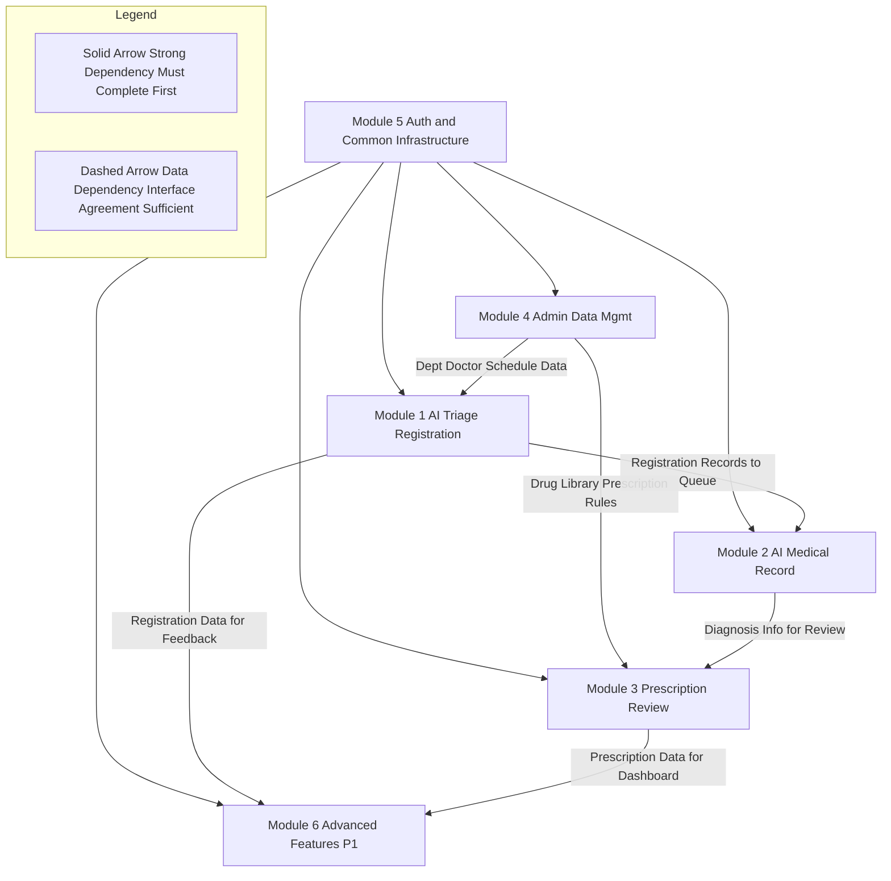

**模块职责详述**：

**认证与用户上下文模块（模块五）** 提供 `ActorContext`、`RolePolicy` 和三端身份解析。所有业务模块必须通过 `ActorContext` 判断患者本人、医生归属和管理员权限，不信任前端传入的 `patientId` 或 `doctorId`。

**基础数据模块（模块四）** 维护科室、医生、排班号源、药品、处方规则、AI 配置和 Prompt 模板。它向分诊、挂号、处方审核和 AI 能力模块提供有效数据视图和版本化配置快照。停用医生、停用排班、下架药品、停用规则、禁用 AI 配置都必须被业务查询尊重；历史挂号、处方、审核和 AI 调用继续展示当时快照。

**分诊与挂号模块（模块一）** 负责症状分诊、推荐落地、号源查询、挂号创建、取消和重复挂号控制。它不拥有科室/医生主数据，只读取基础数据有效视图。`TriageRecord` 是业务记录，不能用 `AICallRecord` 替代；`AICallRecord` 记录技术调用，`TriageRecord` 记录患者看到和可追溯的业务推荐。

**问诊与病历模块（模块二）** 负责医生工作台、患者队列、开始接诊、问诊上下文、AI 病历草稿、正式病历确认和患者病历读侧。**关键修正**：`MedicalRecordDraft` 与 `MedicalRecord` 分离，AI 草稿不得直接成为正式病历。保存正式病历只表示病历已确认和可开方，推进到 `MEDICAL_RECORD_SAVED`，**不表示一次挂号已完成**。

**处方与审核模块（模块三）** 负责药品选择、处方草稿、处方规则引擎、本地规则命中、大模型解释、人工确认降级、处方提交和审核绑定。处方提交必须绑定一个有效 `PrescriptionReview` 或显式人工确认的降级审核记录，不能绕过审核直接创建正式处方。处方提交或医生显式结束就诊才可把挂号推进到 `COMPLETED`。

**AI 能力与审计模块** 负责任务级 AI 接口、供应商解析、AI 配置读取、Prompt 渲染、调用记录和降级响应。业务模块依赖 `TriageAIClientPort`、`MedicalRecordAIClientPort`、`DiagnosisAIClientPort`、`PrescriptionReviewAIClientPort` 等任务级端口，再由本地适配器或 E09 远程适配器实现。

---

## 4. 数据库设计

### 4.1 实体关系总览 ER 图

```mermaid
erDiagram
    Patient ||--o{ Registration : "registers"
    Patient ||--o{ TriageRecord : "triage_history"
    Patient ||--o{ Feedback : "reviews"
    Patient ||--o{ MedicalRecord : "has_medical_records"
    Patient ||--o{ NotificationRecord : "receives"

    Doctor ||--o{ Registration : "assigned_to"
    Doctor }o--|| Department : "belongs_to"
    Doctor ||--o{ Schedule : "has_schedules"
    Doctor ||--o{ MedicalRecord : "generates"
    Doctor ||--o{ PrescriptionReview : "reviewed_by"
    Doctor ||--o{ NotificationRecord : "receives"

    Department ||--o{ Doctor : "has_doctors"
    Department ||--o{ TriageRecord : "recommended_in"

    Registration ||--o{ MedicalRecord : "maps_to"
    Registration ||--o| Feedback : "has_feedback"
    Registration ||--o| Prescription : "linked_to"
    Registration ||--o| DiagnosisSuggestionRecord : "has_suggestions"
    Registration ||--o| ConsultationNote : "has_notes"
    Registration ||--o{ AICallRecord : "has_ai_calls"

    Schedule ||--o{ Registration : "source_of_slots"

    Prescription ||--|{ PrescriptionItem : "contains_items"
    Prescription ||--o| PrescriptionReview : "has_review"
    Prescription }o--|| Doctor : "prescribed_by"
    Prescription }o--|| Patient : "belongs_to"

    PrescriptionItem }o--|| Drug : "references_drug"

    PrescriptionReview ||--o| AICallRecord : "has_ai_call"
    TriageRecord ||--o| AICallRecord : "has_ai_call"
    MedicalRecord ||--o| AICallRecord : "has_ai_call"
    DiagnosisSuggestionRecord ||--o| AICallRecord : "has_ai_call"

    Admin ||--o{ AIConfig : "configures"
    Admin ||--o{ PromptTemplate : "manages"
    Admin ||--o{ HISSyncRecord : "monitors"
    Admin ||--o{ NotificationRecord : "receives"

    NotificationRecord }o--|| PrescriptionReview : "triggers_from"

    Patient {
        bigint id PK
        varchar username UK
        varchar password_hash
        varchar phone
        varchar name
        varchar gender
        date birth_date
        text allergy_history
        text medical_history
        datetime created_at
        tinyint status
    }

    Doctor {
        bigint id PK
        varchar username UK
        varchar password_hash
        varchar name
        bigint department_id FK
        varchar title
        varchar specialty
        text introduction
        datetime created_at
        tinyint status
    }

    Admin {
        bigint id PK
        varchar username UK
        varchar password_hash
        varchar name
        varchar role
        datetime created_at
        tinyint status
    }

    Department {
        bigint id PK
        varchar code UK
        varchar name
        varchar type
        text description
        tinyint status
    }

    Schedule {
        bigint id PK
        bigint doctor_id FK
        bigint department_id FK
        date work_date
        varchar period
        int total_slots
        int remaining_slots
        varchar visit_level
        tinyint status
    }

    Registration {
        bigint id PK
        bigint patient_id FK
        bigint doctor_id FK
        bigint department_id FK
        bigint schedule_id FK
        bigint triage_record_id FK "nullable"
        datetime registration_time
        varchar status "WAITING/IN_CONSULTATION/MEDICAL_RECORD_SAVED/PRESCRIPTION_REVIEWED/PRESCRIPTION_SUBMITTED/COMPLETED/CANCELLED"
        varchar department_snapshot "department name at registration"
        varchar doctor_snapshot "doctor name and title at registration"
        varchar visit_level_snapshot "visit level at registration"
        datetime consultation_start_time
        datetime record_confirmed_time
        datetime prescription_submitted_time
        datetime completed_time
        datetime cancelled_time
        varchar cancel_reason
        tinyint slot_released "0 or 1"
        int version "optimistic lock"
        datetime created_at
    }

    TriageRecord {
        bigint id PK
        bigint patient_id FK
        text chief_complaint
        varchar recommended_dept
        json recommended_doctors
        varchar ai_response_raw
        varchar call_status "AI_SUCCESS/AI_DISABLED/AI_TIMEOUT/AI_PARSE_FAILED/REMOTE_AI_UNAVAILABLE/MANUAL"
        varchar recommendation_source "AI/RULE/MANUAL"
        bigint ai_call_record_id FK "nullable"
        bigint registration_id FK "nullable filled after registration"
        datetime created_at
    }

    MedicalRecord {
        bigint id PK
        bigint patient_id FK
        bigint doctor_id FK
        bigint registration_id FK "one registration may have multiple record versions"
        text chief_complaint
        text present_illness
        text past_history
        text physical_exam
        text preliminary_diagnosis
        text treatment_plan
        text conversation_text
        tinyint ai_generated "1 = AI assisted, 0 = manual"
        bigint ai_call_record_id FK "nullable"
        datetime created_at
        datetime updated_at
        text doc_note "Saving MR pushes registration to MEDICAL_RECORD_SAVED, NOT COMPLETED"
    }

    Prescription {
        bigint id PK
        bigint patient_id FK
        bigint doctor_id FK
        bigint registration_id FK
        bigint review_id FK "the review that cleared this prescription"
        varchar risk_level "LOW/MEDIUM/HIGH/UNKNOWN"
        varchar status "DRAFT/SUBMITTED"
        datetime created_at
    }

    PrescriptionItem {
        bigint id PK
        bigint prescription_id FK
        bigint drug_id FK
        varchar drug_name "snapshot"
        varchar specification "snapshot"
        varchar dosage_form "snapshot"
        varchar package_unit "snapshot"
        varchar manufacturer "snapshot"
        decimal unit_price "snapshot"
        varchar default_usage "snapshot"
        decimal dosage
        varchar frequency
        varchar duration
        int quantity
        text usage_instruction
    }

    Drug {
        bigint id PK
        varchar code UK
        varchar name
        varchar pinyin_code "拼音助记码 for search"
        varchar specification
        varchar dosage_form
        varchar package_unit
        varchar manufacturer
        decimal unit_price
        text default_usage
        text contraindications
        text precautions
        text indications
        text interaction_summary
        tinyint status "0=discontinued 1=active"
    }

    PrescriptionRuleDefinition {
        bigint id PK
        varchar rule_code UK
        varchar rule_type "ALLERGY/CONTRAINDICATION/DRUG_INTERACTION/DOSAGE_RANGE/DUPLICATE_DRUG/DISEASE_CONTRA/DURATION_ANOMALY"
        varchar applicable_drugs "drug IDs or drug group"
        varchar applicable_diseases "optional"
        varchar applicable_populations "CHILD/PREGNANT/ELDERLY/ALL"
        text condition_expression "structured condition JSON"
        varchar risk_level "LOW/MEDIUM/HIGH"
        text alert_message
        text suggestion
        json basis "array of RuleBasis: basisType basisTitle basisClause basisSummary sourceDrugField sourceReference"
        tinyint seeded "0 or 1"
        int version
        varchar validation_status "VALID/INVALID"
        tinyint status "0=disabled 1=enabled"
        datetime created_at
        datetime updated_at
    }

    PrescriptionReview {
        bigint id PK
        bigint prescription_id FK "nullable, filled after binding"
        bigint registration_id FK
        bigint doctor_id FK
        bigint patient_id FK
        varchar risk_level "LOW/MEDIUM/HIGH/UNKNOWN"
        json local_rule_hits "snapshot of RuleHit[]"
        varchar rule_engine_status "SUCCESS/UNAVAILABLE/CONTEXT_MISSING"
        json context_missing_items
        text llm_suggestion
        text llm_summary
        varchar llm_call_status "AI_SUCCESS/AI_DISABLED/AI_TIMEOUT/REMOTE_AI_UNAVAILABLE/AI_PARSE_FAILED"
        bigint ai_call_record_id FK "nullable"
        varchar prescription_snapshot_hash
        varchar review_context_hash
        text manual_confirmation "doctor confirmation text"
        varchar bind_status "UNBOUND/BOUND"
        datetime created_at
    }

    Feedback {
        bigint id PK
        bigint patient_id FK
        bigint registration_id FK
        tinyint rating
        tinyint triage_accurate
        text comment
        datetime created_at
    }

    AIConfig {
        bigint id PK
        varchar provider
        varchar model_name
        varchar api_url
        varchar api_key_encrypted "AES encrypted, write-only"
        varchar key_version "for key rotation"
        varchar task_scope "TRIAGE/MEDICAL_RECORD/DIAGNOSIS/PRESCRIPTION_REVIEW/ALL"
        int timeout_seconds
        tinyint is_default "0 or 1, unique per task_scope"
        varchar health_status "HEALTHY/DEGRADED/DOWN"
        varchar config_version
        tinyint status "0=disabled 1=enabled"
        datetime created_at
        datetime updated_at
    }

    AICallRecord {
        bigint id PK
        varchar task_type "TRIAGE/MEDICAL_RECORD/DIAGNOSIS/PRESCRIPTION_REVIEW"
        bigint business_record_id "triage_record_id / medical_record_id / diagnosis_suggestion_record_id / prescription_review_id"
        bigint operator_id
        varchar operator_role "PATIENT/DOCTOR/ADMIN"
        varchar provider
        varchar model_name
        varchar config_version
        varchar prompt_version
        text input_summary "truncated"
        text output_summary "truncated"
        varchar call_status "AI_SUCCESS/AI_DISABLED/AI_TIMEOUT/REMOTE_AI_UNAVAILABLE/AI_PARSE_FAILED"
        text error_summary
        int duration_ms
        varchar trace_id
        tinyint degraded "0 or 1"
        datetime created_at
    }

    DiagnosisSuggestionRecord {
        bigint id PK
        bigint registration_id FK
        bigint patient_id FK
        bigint doctor_id FK
        bigint consultation_note_id FK
        json suggested_diagnoses "SuggestedDiagnosis[]"
        json suggested_exam_items "SuggestedExamItem[], reference only"
        varchar adoption_status "NONE/PARTIALLY_ADOPTED/FULLY_ADOPTED/REJECTED"
        varchar final_diagnosis_direction
        bigint adoption_doctor_id
        datetime adoption_time
        bigint ai_call_record_id FK
        datetime created_at
    }

    ConsultationNote {
        bigint id PK
        bigint registration_id FK
        bigint doctor_id FK
        text conversation_text
        varchar chief_complaint_summary
        varchar diagnosis_direction
        text patient_context
        datetime created_at
    }

    NotificationRecord {
        bigint id PK
        bigint recipient_id
        varchar recipient_role "DOCTOR/ADMIN"
        varchar alert_type "HIGH_RISK_PRESCRIPTION/REVIEW_UNCERTAIN_MANUAL_REQUIRED"
        varchar statistics_bucket "LOW/MEDIUM/HIGH/UNKNOWN"
        varchar display_level "WARNING/INFO"
        bigint business_record_id "prescription_review_id"
        varchar patient_summary "truncated"
        varchar risk_summary
        tinyint is_read "0 or 1"
        datetime created_at
    }

    PromptTemplate {
        bigint id PK
        varchar template_code UK
        varchar task_type "TRIAGE/MEDICAL_RECORD/DIAGNOSIS/PRESCRIPTION_REVIEW"
        varchar dept_code "optional, null = default"
        text template_body
        json variable_whitelist
        int version
        tinyint is_default "0 or 1"
        tinyint status "0=disabled 1=enabled"
        datetime created_at
        datetime updated_at
    }

    HISSyncRecord {
        bigint id PK
        varchar sync_type "PATIENT_IDENTITY/ORDER_SETTLEMENT/EXAM_LAB/PHARMACY_DISPENSE/DRUG_STOCK"
        varchar idempotent_key UK
        varchar external_id
        varchar sync_status "PENDING/SUCCESS/FAILED/RETRYING/MANUAL_REQUIRED"
        text request_summary
        text response_summary
        text error_summary
        int retry_count
        datetime next_retry_at
        datetime created_at
        datetime updated_at
    }
```

### 4.2 核心表结构设计

#### 模块一相关

| 表名              | 核心字段                                                                                                                     | 索引                                                     |
| ----------------- | ---------------------------------------------------------------------------------------------------------------------------- | -------------------------------------------------------- |
| `patient`       | id, username, password_hash, phone, name, gender, birth_date, allergy_history, medical_history                               | UK(username), INDEX(phone)                               |
| `department`    | id, code, name, type, status                                                                                                 | UK(code)                                                 |
| `doctor`        | id, username, password_hash, name, department_id, title, specialty, introduction, status                                      | FK(department_id)                                        |
| `schedule`      | id, doctor_id, department_id, work_date, period, total_slots, remaining_slots, visit_level, status, version                    | FK(doctor_id, department_id), INDEX(work_date)            |
| `registration`  | id, patient_id, doctor_id, department_id, schedule_id, triage_record_id, status, department_snapshot, doctor_snapshot, visit_level_snapshot, consultation_start_time, record_confirmed_time, prescription_submitted_time, completed_time, cancelled_time, cancel_reason, slot_released, version | FK(patient_id, doctor_id, schedule_id), UK(patient_id, schedule_id) WHERE status NOT CANCELLED |
| `triage_record` | id, patient_id, chief_complaint, recommended_dept, recommended_doctors(JSON), call_status, recommendation_source, ai_call_record_id, registration_id | FK(patient_id)                                           |

#### 模块二相关

| 表名                  | 核心字段                                                                                                                                                                                           | 索引                                       |
| --------------------- | -------------------------------------------------------------------------------------------------------------------------------------------------------------------------------------------------- | ------------------------------------------ |
| `medical_record`    | id, patient_id, doctor_id, registration_id, chief_complaint, present_illness, past_history, physical_exam, preliminary_diagnosis, treatment_plan, conversation_text, ai_generated, ai_call_record_id | FK(patient_id, doctor_id, registration_id) |
| `consultation_note` | id, registration_id, doctor_id, conversation_text, chief_complaint_summary, diagnosis_direction, patient_context(JSON), created_at                                                                  | FK(registration_id)                        |

#### 模块三相关

| 表名                           | 核心字段                                                                                                                            | 索引                                       |
| ------------------------------ | ----------------------------------------------------------------------------------------------------------------------------------- | ------------------------------------------ |
| `prescription`               | id, patient_id, doctor_id, registration_id, review_id, risk_level, status                                                           | FK(patient_id, doctor_id, registration_id) |
| `prescription_item`          | id, prescription_id, drug_id, drug_name, specification, dosage_form, package_unit, manufacturer, unit_price, default_usage, dosage, frequency, duration, quantity, usage_instruction | FK(prescription_id, drug_id)               |
| `prescription_review`        | id, prescription_id, registration_id, doctor_id, patient_id, risk_level, local_rule_hits(JSON), rule_engine_status, context_missing_items(JSON), llm_suggestion, llm_summary, llm_call_status, ai_call_record_id, prescription_snapshot_hash, review_context_hash, manual_confirmation, bind_status | FK(prescription_id), FK(ai_call_record_id)  |
| `drug`                       | id, code, name, pinyin_code, specification, dosage_form, contraindications, interaction_summary, status                             | UK(code), INDEX(name), INDEX(pinyin_code)  |
| `prescription_rule_definition` | id, rule_code, rule_type, applicable_drugs, condition_expression, risk_level, alert_message, suggestion, basis(JSON), seeded, version, validation_status, status | UK(rule_code)                              |

#### 模块四/五/六相关

| 表名                          | 核心字段                                                                                                                     | 索引                            |
| ----------------------------- | ---------------------------------------------------------------------------------------------------------------------------- | ------------------------------- |
| `admin`                     | id, username, password_hash, name, role                                                                                      | UK(username)                    |
| `ai_config`                 | id, provider, model_name, api_url, api_key_encrypted, key_version, task_scope, timeout_seconds, is_default, health_status, config_version, status | INDEX(task_scope)               |
| `ai_call_record`            | id, task_type, business_record_id, operator_id, operator_role, provider, model_name, config_version, prompt_version, input_summary, output_summary, call_status, error_summary, duration_ms, trace_id, degraded | INDEX(task_type, call_status), INDEX(business_record_id) |
| `feedback`                  | id, patient_id, registration_id, rating, triage_accurate, comment, created_at                                                | UK(registration_id)             |
| `triage_accuracy_feedback`  | id, feedback_id, recommended_dept_snapshot, actual_dept_snapshot, accuracy_label, reason_tags, notes                          | FK(feedback_id)                 |
| `diagnosis_suggestion_record` | id, registration_id, patient_id, doctor_id, consultation_note_id, suggested_diagnoses(JSON), suggested_exam_items(JSON), adoption_status, final_diagnosis_direction, adoption_doctor_id, adoption_time, ai_call_record_id | FK(registration_id, ai_call_record_id) |
| `notification_record`       | id, recipient_id, recipient_role, alert_type, statistics_bucket, display_level, business_record_id, patient_summary, risk_summary, is_read | INDEX(recipient_id, is_read)     |
| `prompt_template`           | id, template_code, task_type, dept_code, template_body, variable_whitelist(JSON), version, is_default, status                 | UK(template_code)               |
| `his_sync_record`           | id, sync_type, idempotent_key, external_id, sync_status, request_summary, response_summary, error_summary, retry_count, next_retry_at | UK(idempotent_key)              |

---

## 5. 核心模块详细设计

### 5.1 模块一：智能分诊与挂号模块

#### 5.1.1 模块概述

**负责人**：成员 A

**职责**：

- AI 分诊：接收患者主诉 → 调用大模型 → 推荐科室与医生 → 持久化分诊记录（`TriageRecord`），AI 调用记录（`AICallRecord`）与业务记录分离
- 公开查询：科室列表/详情、医生列表/详情（供患者端浏览，无需登录）
- 号源查询：按医生 + 日期查询可用排班号源
- 挂号管理：创建挂号（并发安全扣减号源）、查询我的挂号、取消挂号（仅 `WAITING` 状态可取消，释放号源只一次）
- 挂号状态管理：`RegistrationLifecyclePolicy` 管理挂号从 `WAITING` → `CANCELLED` 的唯一取消边界

**依赖**：模块五（认证基础设施、`ActorContext`）、模块四（科室/医生/排班数据）

**核心状态机说明**：挂号创建后进入 `WAITING` 状态，仅此阶段患者可取消。一旦医生开始接诊，挂号进入 `IN_CONSULTATION`，患者取消被拒绝。完整状态流转见下文状态机定义。

#### 5.1.2 类图

```mermaid
classDiagram
    direction TB

    class TriageController {
        +consult(TriageRequest) Result_TriageResponse_
        +history() Result_List_
    }

    class RegistrationController {
        +create(RegistrationRequest) Result_RegistrationVO_
        +listByPatient() Result_List_
        +cancel(Long registrationId) Result_Void_
        +getById(Long id) Result_RegistrationVO_
    }

    class DepartmentController {
        +list() Result_List_
        +getById(Long id) Result_DepartmentVO_
    }

    class DoctorController {
        +listByDept(Long deptId) Result_List_
        +getById(Long id) Result_DoctorVO_
    }

    class ScheduleController {
        +getAvailable(Long doctorId, Date date) Result_List_
    }

    class TriageCoordinator {
        +consult(String chiefComplaint, Long patientId) TriageResponse
        -validateInput(String complaint) void
        -callAITriage(String complaint) TriageAIResponse
        -matchRecommendation(TriageAIResponse) TriageRecommendation
        -buildFallback() TriageRecommendation
    }

    class TriageRecommendation {
        +String deptId
        +String deptName
        +List_DoctorSuggestion_ doctors
        +String recommendationReason
        +String recommendationSource AI_RULE_MANUAL
        +Double confidence
    }

    class RegistrationCommandService {
        +create(RegistrationRequest, Long patientId) Registration
        +cancel(Long registrationId, Long patientId) void
        -validateSchedule(Long scheduleId) void
        -decrementSlot(Long scheduleId) void
        -releaseSlot(Long scheduleId) void
    }

    class RegistrationLifecyclePolicy {
        +canCancel(Registration) boolean
        +canBeginConsultation(Registration, Long doctorId) boolean
        +assertTransition(Registration, RegistrationStatus target) void
    }

    class RegistrationStatus {
        <<enumeration>>
        WAITING
        IN_CONSULTATION
        MEDICAL_RECORD_SAVED
        PRESCRIPTION_REVIEWED
        PRESCRIPTION_SUBMITTED
        COMPLETED
        CANCELLED
    }

    class TriageRecordRepository {
        +findByPatientIdOrderByCreatedAtDesc(Long patientId) List
        +findByIdWithAICallRecord(Long id) Optional
    }

    class RegistrationRepository {
        +findByPatientIdOrderByCreatedAtDesc(Long patientId) List
        +findByDoctorIdAndStatus(Long doctorId, String status) List
        +findByPatientIdAndScheduleIdAndStatusNot(Long, Long, String) Optional
    }

    class ScheduleRepository {
        +findByDoctorIdAndWorkDateAndRemainingSlotsGreaterThan(Long, Date, int) List
        +decrementSlotWithVersion(Long scheduleId, int version) int
        +releaseSlotOnce(Long scheduleId) int
    }

    class DepartmentRepository {
        +findByStatus(Integer status) List
    }

    class DoctorRepository {
        +findByDepartmentIdAndStatus(Long deptId, Integer status) List
    }

    TriageController --> TriageCoordinator : "calls"
    TriageController --> TriageRecordRepository : "uses"
    RegistrationController --> RegistrationCommandService : "calls"
    DepartmentController --> DepartmentRepository : "uses"
    DoctorController --> DoctorRepository : "uses"
    ScheduleController --> ScheduleRepository : "uses"
    RegistrationCommandService --> RegistrationLifecyclePolicy : "uses"
    RegistrationCommandService --> ScheduleRepository : "uses"
    RegistrationCommandService --> RegistrationRepository : "uses"
    TriageCoordinator --> TriageRecordRepository : "uses"
```

#### 5.1.3 核心时序图

**流程 A：智能分诊与挂号**

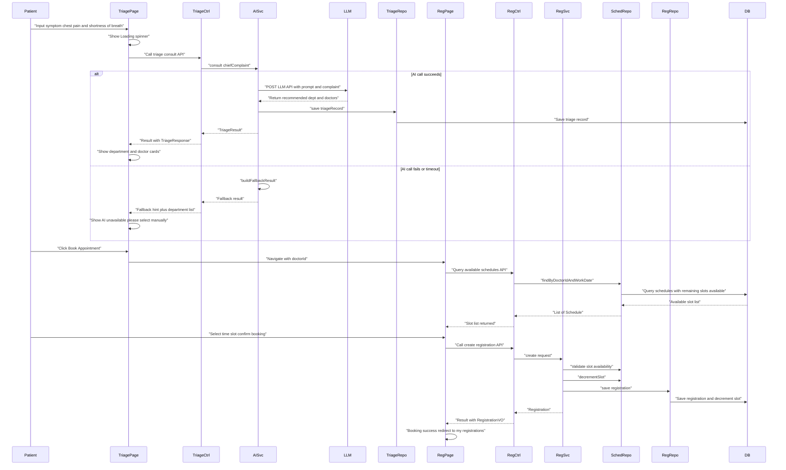

**流程 B：取消挂号（号源释放 + 状态机控制）**

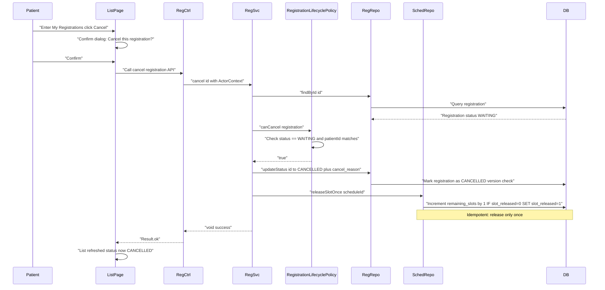

#### 5.1.4 挂号状态机全定义（跨模块契约）

`RegistrationStatus` 是一次挂号从预约到诊疗闭环完成的权威状态，所有模块（一至六）必须基于此状态机判断可用操作。

| 状态 | 语义 | 允许主要操作 | 禁止或边界 |
|---|---|---|---|
| `WAITING` | 患者已挂号，尚未由医生开始接诊 | 患者取消挂号；医生开始接诊；患者/医生查看 | 不允许保存病历、审核处方、提交处方、评价 |
| `IN_CONSULTATION` | 医生已开始接诊，问诊工作区打开 | 录入问诊；生成 AI 病历草稿；保存正式病历；必要时医生结束无处方就诊 | 患者取消；处方提交前需满足病历或诊断上下文要求 |
| `MEDICAL_RECORD_SAVED` | 正式病历已保存，进入可开方阶段 | 开处方草稿；处方审核；重新保存病历并使旧审核失效；医生结束无处方就诊 | 不代表就诊完成；评价入口不开启 |
| `PRESCRIPTION_REVIEWED` | 最近一次处方草稿已通过审核或进入人工确认降级 | 修改处方后重新审核；提交处方；查看审核详情 | 若处方或审核上下文变化，旧审核不可用于提交 |
| `PRESCRIPTION_SUBMITTED` | 正式处方已提交并绑定审核记录 | 由提交处方用例自动或医生结束动作推进到完成；患者查看处方 | 不允许取消挂号；评价仍以 `COMPLETED` 为开放状态 |
| `COMPLETED` | 本次就诊已完成，患者可评价，患者端病历处方均可查看 | 患者评价；患者/医生/管理员历史查看；看板统计完成就诊数 | 终态，不再允许修改挂号状态；更正病历/处方需独立更正流程 |
| `CANCELLED` | 患者或系统在可取消阶段取消挂号 | 历史查看；取消后患者可重新挂同一号源或其他号源 | 终态，不允许接诊、病历、处方、评价；号源只释放一次 |

**状态流转触发表**：

| 触发动作 | 前置状态 | 后置状态 | 关键前置条件 | 幂等和冲突规则 |
|---|---|---|---|---|
| 创建挂号 | 无 | `WAITING` | 患者已登录；号源有效且有余量；同一患者同一 `schedule_id` 无有效挂号 | 重复提交若已创建同等挂号，可返回既有挂号摘要；并发唯一约束兜底 |
| 取消挂号 | `WAITING` | `CANCELLED` | 当前患者本人；未开始接诊；未取消过 | 重复取消返回已取消或幂等成功；不得重复释放号源 |
| 开始接诊 | `WAITING` | `IN_CONSULTATION` | 当前医生为挂号医生；挂号未取消 | 同一医生重复开始返回当前工作区；非归属医生返回 403/状态冲突 |
| 保存正式病历 | `IN_CONSULTATION` 或 `MEDICAL_RECORD_SAVED` | `MEDICAL_RECORD_SAVED` | 当前医生归属；病历结构化字段通过校验 | 重复保存更新病历版本；若处方已审核但病历影响审核上下文，旧审核失效 |
| 完成处方审核 | `MEDICAL_RECORD_SAVED` 或 `PRESCRIPTION_REVIEWED` | `PRESCRIPTION_REVIEWED` | 处方草稿存在；规则引擎完成或进入人工确认降级 | 同一处方快照可复用最近审核；处方内容变化必须新建审核 |
| 提交处方 | `PRESCRIPTION_REVIEWED` | `PRESCRIPTION_SUBMITTED` 或直接 `COMPLETED` | 有有效 `reviewId`；处方快照哈希和上下文哈希一致；医生确认风险 | 重复提交同一审核返回既有处方；同一审核只能绑定一次 |
| 医生结束就诊 | `MEDICAL_RECORD_SAVED` 或 `PRESCRIPTION_SUBMITTED` | `COMPLETED` | 至少有正式病历；若存在处方草稿则必须已提交或明确放弃 | 重复结束返回已完成；未保存病历不得完成 |
| 自动完成就诊 | `PRESCRIPTION_SUBMITTED` | `COMPLETED` | 处方提交事务成功，且业务选择"提交处方即完成本次就诊" | 自动完成需在 API 与时序图中明确；否则由结束就诊动作触发 |

**允许操作矩阵**（前后端必须统一使用）：

| 操作 | `WAITING` | `IN_CONSULTATION` | `MEDICAL_RECORD_SAVED` | `PRESCRIPTION_REVIEWED` | `PRESCRIPTION_SUBMITTED` | `COMPLETED` | `CANCELLED` |
|---|---|---|---|---|---|---|---|
| 患者取消挂号 | 允许 | 禁止 | 禁止 | 禁止 | 禁止 | 禁止 | 幂等查看 |
| 医生开始接诊 | 允许 | 幂等 | 禁止 | 禁止 | 禁止 | 禁止 | 禁止 |
| AI 生成病历草稿 | 禁止 | 允许 | 允许 | 允许但可能使旧审核失效 | 只读或更正流程 | 只读或更正流程 | 禁止 |
| 保存正式病历 | 禁止 | 允许 | 允许 | 允许但旧审核失效 | 只读或更正流程 | 只读或更正流程 | 禁止 |
| 处方审核 | 禁止 | 需至少有诊断上下文 | 允许 | 允许重审 | 禁止或更正流程 | 禁止或更正流程 | 禁止 |
| 提交处方 | 禁止 | 禁止 | 禁止 | 允许 | 幂等查看 | 禁止 | 禁止 |
| 结束就诊 | 禁止 | 可结束无处方但需病历 | 允许无处方完成 | 需提交或放弃处方草稿 | 允许/自动 | 幂等 | 禁止 |
| 患者评价 | 禁止 | 禁止 | 禁止 | 禁止 | 禁止 | 允许 | 禁止 |
| 患者查看病历 | 可无记录 | 可无记录 | 允许 | 允许 | 允许 | 允许 | 可无记录 |
| 患者查看处方 | 可无记录 | 可无记录 | 可无记录 | 可无正式处方 | 允许 | 允许 | 可无记录 |

**关键约束**：
- 可取消边界固定为 `WAITING`。一旦医生开始接诊进入 `IN_CONSULTATION`，患者端取消挂号必须被拒绝
- 评价开放条件固定为 `RegistrationStatus.COMPLETED` 且当前患者为挂号患者本人
- `COMPLETED` 是就诊终态，不是病历保存状态；`PRESCRIPTION_SUBMITTED` 如果未自动推进到 `COMPLETED`，不得开放评价

---

### 5.2 模块二：AI 病历生成模块

#### 5.2.1 模块概述

**负责人**：成员 B

**职责**：医生工作台患者队列 → 开始接诊（推进 `Registration` 到 `IN_CONSULTATION`）→ 问诊对话录入（`ConsultationNote`）→ 调用 AI 病历生成引擎 → 结构化字段回填表单（`MedicalRecordDraft`，草稿不自动成为正式病历）→ 医生编辑确认 → 保存正式病历（推进 `Registration` 到 `MEDICAL_RECORD_SAVED`，**不代表就诊完成**）。病历列表与按患者搜索；就诊完成由模块三处方提交或独立结束就诊动作触发。

**关键修正（v3.0）**：保存病历只推进到 `MEDICAL_RECORD_SAVED`（病历已确认/可开方），不再标记挂号完成。`COMPLETED` 由处方提交或医生结束就诊触发。`MedicalRecordDraft` 与 `MedicalRecord` 分离，AI 草稿不自动成为正式病历。

**依赖**：模块五（认证、`ActorContext`）、模块一（挂号信息、状态机）

#### 5.2.2 类图

```mermaid
classDiagram
    direction TB

    class MedicalRecordController {
        +generate(GenerateRequest) Result_MedicalRecordDraftVO_
        +save(SaveRequest) Result_MedicalRecordVO_
        +getById(Long id) Result_MedicalRecordVO_
        +listByPatient(Long patientId) Result_List_
        +listByDoctor() Result_List_
        +search(String keyword) Result_List_
    }

    class ConsultationController {
        +begin(Long registrationId) Result_ConsultationWorkspaceVO_
        +getWorkspace(Long registrationId) Result_ConsultationWorkspaceVO_
        +complete(Long registrationId) Result_Void_
    }

    class ConsultationApplicationService {
        +beginConsultation(Long registrationId, Long doctorId) ConsultationWorkspace
        +getWorkspace(Long registrationId, Long doctorId) ConsultationWorkspace
        +completeConsultation(Long registrationId, Long doctorId) void
        +saveConsultationNote(ConsultationNoteRequest) ConsultationNote
    }

    class ConsultationWorkspace {
        +PatientSummaryVO patientInfo
        +RegistrationContextVO registration
        +ConsultationNote consultationNote
        +MedicalRecordDraft draftRecord
        +MedicalRecord formalRecord
        +List_AvailableAction_ actions
    }

    class ConsultationNote {
        +Long id
        +Long registrationId
        +String conversationText
        +String chiefComplaintSummary
        +String diagnosisDirection
        +JSON patientContext
    }

    class AIMedicalRecordService {
        +generate(String conversation, String diagnosis, PatientInfo) StructuredMR
        -buildPrompt(String conversation, String diagnosis, PatientInfo) String
        -callLLMAPI(String prompt) String
        -parseToStructuredMR(String raw) StructuredMR
        -buildFallbackResult() StructuredMR
    }

    class MedicalRecordService {
        +generateDraft(GenerateRequest, Long doctorId) MedicalRecordDraftVO
        +saveFormalRecord(SaveRequest, Long doctorId) MedicalRecord
        +getById(Long id) MedicalRecord
        +listByPatient(Long patientId) List
        +listByDoctor(Long doctorId) List
        +searchByKeyword(String keyword) List
    }

    class MedicalRecordDraft {
        +String chiefComplaint
        +String presentIllness
        +String pastHistory
        +String physicalExam
        +String preliminaryDiagnosis
        +String treatmentPlan
        +List_FieldHint_ missingFieldHints
    }

    class MedicalRecord {
        +Long id
        +Long patientId
        +Long doctorId
        +Long registrationId
        +Long aiCallRecordId
        +Boolean aiGenerated
        +Date createdAt
        +Date updatedAt
    }

    class RegistrationLifecyclePolicy {
        +canBeginConsultation(Registration, Long doctorId) boolean
        +canSaveMedicalRecord(Registration, Long doctorId) boolean
        +assertTransition(Registration, RegistrationStatus target) void
    }

    class MedicalRecordRepository {
        +findByPatientIdOrderByCreatedAtDesc(Long patientId) List
        +findByDoctorIdOrderByCreatedAtDesc(Long doctorId) List
        +findByPatientNameOrId(String keyword) List
    }

    class PatientRepository {
        +findById(Long id) Optional
    }

    class RegistrationRepository {
        +updateStatusWithVersion(Long id, String status, int version) int
    }

    MedicalRecordController --> MedicalRecordService : "calls"
    MedicalRecordController --> AIMedicalRecordService : "calls"
    ConsultationController --> ConsultationApplicationService : "calls"
    MedicalRecordService --> AIMedicalRecordService : "calls"
    MedicalRecordService --> MedicalRecordRepository : "uses"
    MedicalRecordService --> RegistrationLifecyclePolicy : "uses"
    MedicalRecordService --> RegistrationRepository : "uses"
    ConsultationApplicationService --> RegistrationLifecyclePolicy : "uses"
    ConsultationApplicationService --> RegistrationRepository : "uses"
    MedicalRecordService --> PatientRepository : "uses"
```

#### 5.2.3 核心时序图

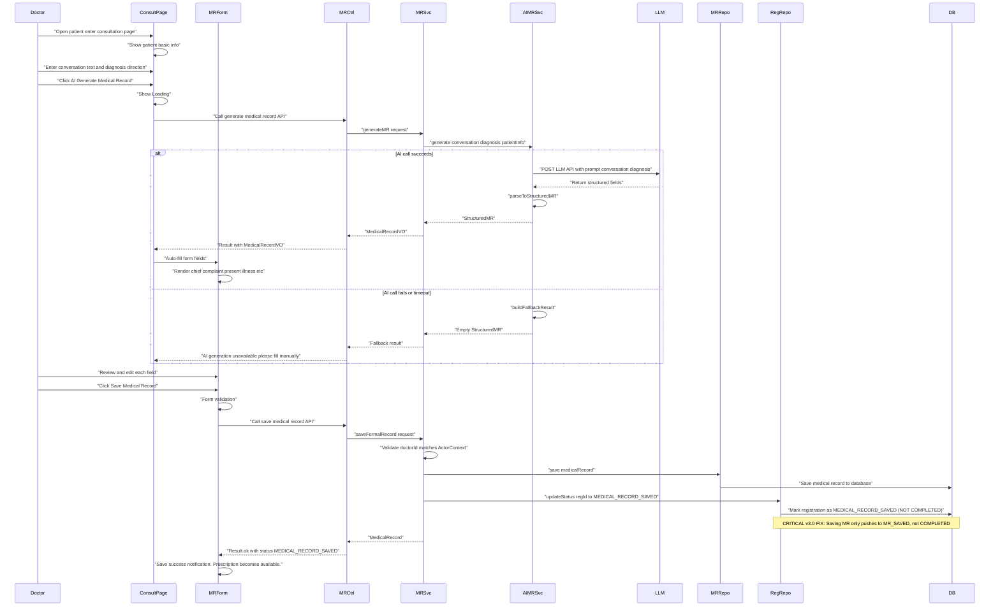

---

### 5.3 模块三：处方审核与开具模块

#### 5.3.1 模块概述

**负责人**：成员 C

**职责**：从药品库选择药品 → 开具处方草稿 → 构造患者用药上下文（`PatientMedicationContext`）→ 本地规则引擎审核（`LocalRuleEngine`，先于 LLM 执行）→ 大模型解释补充 → 审核结果展示（规则命中 `RuleHit` + LLM 解释）→ 人工确认降级 → 提交处方时重算快照哈希（`PrescriptionSnapshot`）、绑定审核记录（`PrescriptionReview`）→ 处方提交或结束就诊推进 `COMPLETED`。处方列表与审核记录查询。

**核心设计——"本地规则优先 + 大模型解释"**：

```
处方审核请求
  → PatientMedicationContext 构造（年龄/性别/过敏史/既往史/特殊人群/诊断/科室）
  → PrescriptionSnapshot 生成（规范化处方项 + 上下文摘要 + 稳定哈希）
  → LocalRuleEngine 执行（过敏/禁忌/相互作用/剂量/重复用药/疾病禁忌/疗程）→ 命中 RuleHit 列表
  → 若 LLM 可用：基于命中规则 + 处方上下文 生成自然语言解释
  → 合并返回 规则命中项 + 风险等级 + LLM 解释 + 人工确认状态
  → 写入 PrescriptionReview（含快照哈希、规则引擎状态、LLM 调用状态、绑定状态 UNBOUND）

处方提交
  → 医生携带 reviewId
  → 后端重算 PrescriptionSnapshot 哈希 + 上下文哈希
  → 与 PrescriptionReview 中哈希比对
  → 一致 → 提交成功、绑定 reviewId、推进 COMPLETED
  → 不一致 → 返回"处方内容已变化，请重新审核"
```

**关键约束**：提交必须绑定有效 `reviewId`；一个 `PrescriptionReview` 最多绑定一个处方；处方内容或上下文变化旧审核失效；本地规则不可用只能 `UNKNOWN`/人工确认，不得伪装低风险。

**依赖**：模块五（认证、`ActorContext`）、模块四（药品库/处方规则定义）、模块二（`ConsultationNote`、诊断方向、`MedicalRecord`）

#### 5.3.2 类图

```mermaid
classDiagram
    direction TB

    class PrescriptionController {
        +create(PrescriptionSubmitRequest) Result_PrescriptionVO_
        +check(PrescriptionCheckRequest) Result_ReviewResultVO_
        +listByPatient(Long patientId) Result_List_
        +listByDoctor() Result_List_
        +getById(Long id) Result_PrescriptionVO_
        +getReviewByPrescription(Long id) Result_ReviewDetailVO_
    }

    class PrescriptionService {
        +submitPrescription(PrescriptionSubmitRequest, Long doctorId) Prescription
        +getById(Long id) Prescription
        +listByPatient(Long patientId) List
        +listByDoctor(Long doctorId) List
        +buildPrescriptionItems(PrescriptionRequest) List_PrescriptionItem_
    }

    class PrescriptionReviewApplicationService {
        +review(PrescriptionCheckRequest, Long doctorId) ReviewResult
        +validateBeforeSubmit(Long reviewId, PrescriptionCheckRequest) ReviewValidation
        -constructPatientMedicationContext(Long patientId, Long registrationId) PatientMedicationContext
        -generatePrescriptionSnapshot(List_PrescriptionItem_, PatientMedicationContext) PrescriptionSnapshot
        -runLocalRules(RuleEvaluationContext) List_RuleHit_
        -callLLMReview(List_RuleHit_, RuleEvaluationContext) LLMReview
        -calculateRiskLevel(List_RuleHit_) RiskLevel
        -buildFallbackReview(List_RuleHit_) ReviewResult
    }

    class PatientMedicationContext {
        +String ageGroup
        +String gender
        +String allergyHistory
        +String medicalHistory
        +String specialPopulation CHILD_PREGNANT_ELDERLY
        +String diagnosisDirection
        +String deptCode
        +JSON vitals
        +String recordSummary
    }

    class PrescriptionSnapshot {
        +List_NormalizedItem_ normalizedItems
        +String itemsHash
        +String contextHash
        +String combinedHash
    }

    class RuleEvaluationContext {
        +PrescriptionSnapshot snapshot
        +PatientMedicationContext patientContext
        +List_DrugSnapshot_ drugSnapshots
        +List_RuleVersion_ availableRules
    }

    class LocalRuleEngine {
        +executeRuleCheck(RuleEvaluationContext) List_RuleHit_
        +checkAllergyConflict(Drug, PatientInfo) List_RuleHit_
        +checkContraindication(Drug, PatientInfo) List_RuleHit_
        +checkDrugInteraction(Drug, Drug) List_RuleHit_
        +checkDosageRange(Drug, Dosage) List_RuleHit_
        +checkDuplicateDrug(List_Drug_) List_RuleHit_
        +checkDiseaseContraindication(Drug, Diagnosis) List_RuleHit_
        +checkDurationAnomaly(Drug, Duration) List_RuleHit_
    }

    class RuleHit {
        +String ruleId
        +int ruleVersion
        +String ruleType
        +String riskLevel LOW_MEDIUM_HIGH
        +String alertMessage
        +String suggestion
        +List_DrugHitItem_ hitDrugItems
        +List_String_ contextMissingItems
        +JSON basisSnapshot
    }

    class RuleDefinitionCompiler {
        +validate(RuleDefinition) ValidationResult
        +compile(List_RuleDefinition_) List_RuntimeRule_
        +freezeVersion(Long ruleId) int
    }

    class PrescriptionReview {
        +Long id
        +Long prescriptionId "nullable before binding"
        +String riskLevel
        +JSON localRuleHits
        +String ruleEngineStatus SUCCESS_UNAVAILABLE_CONTEXT_MISSING
        +List_String_ contextMissingItems
        +String llmSuggestion
        +String llmCallStatus
        +String prescriptionSnapshotHash
        +String reviewContextHash
        +String manualConfirmation
        +String bindStatus UNBOUND_BOUND
    }

    class DrugRepository {
        +findById(Long id) Optional
        +findByNameContaining(String keyword) List
        +findActiveById(Long id) Optional
    }

    class PrescriptionRuleDefinitionRepository {
        +findEnabledByDrugIds(List_Long_ drugIds) List
        +findEnabledByDiseaseContra(String disease) List
    }

    class PrescriptionRepository {
        +findByPatientIdOrderByCreatedAtDesc(Long patientId) List
        +findByDoctorIdOrderByCreatedAtDesc(Long doctorId) List
    }

    class PrescriptionReviewRepository {
        +findByIdAndBindStatus(Long id, String bindStatus) Optional
        +findByPrescriptionId(Long prescriptionId) Optional
    }

    PrescriptionController --> PrescriptionService : "calls"
    PrescriptionController --> PrescriptionReviewApplicationService : "calls"
    PrescriptionReviewApplicationService --> LocalRuleEngine : "calls"
    PrescriptionReviewApplicationService --> RuleDefinitionCompiler : "uses"
    PrescriptionReviewApplicationService --> PrescriptionRuleDefinitionRepository : "uses"
    PrescriptionReviewApplicationService --> PrescriptionReviewRepository : "uses"
    PrescriptionService --> PrescriptionRepository : "uses"
    PrescriptionService --> DrugRepository : "uses"
    PrescriptionService --> PrescriptionReviewRepository : "uses"
```

#### 5.3.3 核心时序图

**流程 A：处方审核（本地规则 + 大模型）**

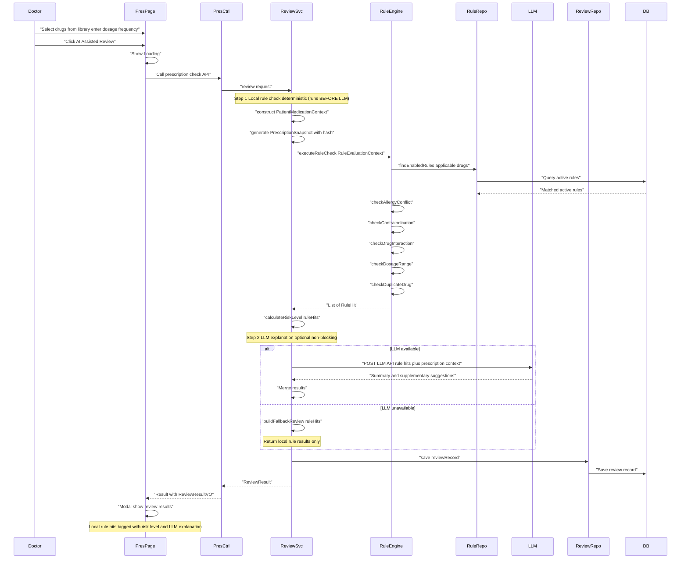

**流程 B：处方提交保存（审核绑定 + 状态推进）**

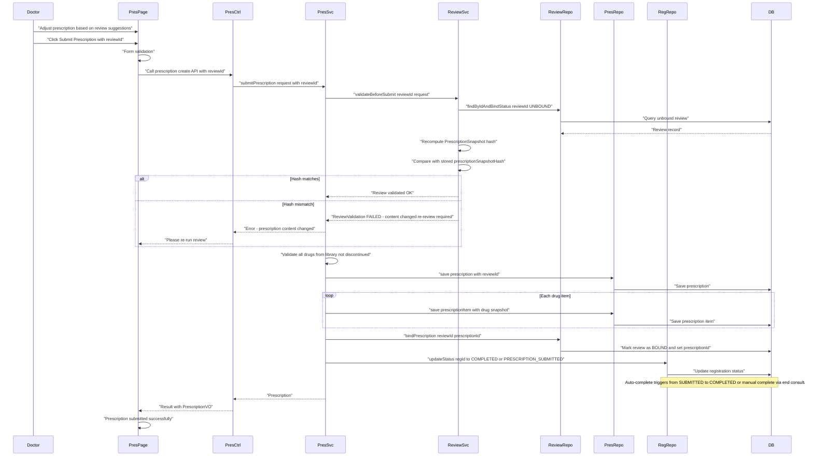

---

### 5.4 模块四：管理端基础数据模块

#### 5.4.1 模块概述

**负责人**：成员 D

**职责**：管理端全部基础数据维护——科室 CRUD、医生 CRUD、排班号源 CRUD 及批量创建、药品库 CRUD、处方审核规则 CRUD、AI 服务配置、AI 调用记录查看。

**被依赖**：模块一（科室/医生/排班）、模块三（药品库/规则）

#### 5.4.2 类图

```mermaid
classDiagram
    direction TB

    class AdminDepartmentController {
        +list() Result_List_
        +getById(Long id) Result_DepartmentVO_
        +create(DepartmentRequest) Result_DepartmentVO_
        +update(Long id, DepartmentRequest) Result_DepartmentVO_
        +toggleStatus(Long id) Result_Void_
    }

    class AdminDoctorController {
        +list(Long deptId) Result_List_
        +getById(Long id) Result_DoctorVO_
        +create(DoctorRequest) Result_DoctorVO_
        +update(Long id, DoctorRequest) Result_DoctorVO_
        +toggleStatus(Long id) Result_Void_
    }

    class AdminScheduleController {
        +list(Long doctorId, Date from, Date to) Result_List_
        +create(ScheduleRequest) Result_ScheduleVO_
        +update(Long id, ScheduleRequest) Result_ScheduleVO_
        +toggleStatus(Long id) Result_Void_
        +batchCreate(BatchScheduleRequest) Result_List_
    }

    class AdminDrugController {
        +list(String keyword, Integer status) Result_List_
        +getById(Long id) Result_DrugVO_
        +create(DrugRequest) Result_DrugVO_
        +update(Long id, DrugRequest) Result_DrugVO_
        +toggleStatus(Long id) Result_Void_
    }

    class AdminRuleController {
        +list(Long drugId, String ruleType) Result_List_
        +create(RuleRequest) Result_RuleVO_
        +update(Long id, RuleRequest) Result_RuleVO_
        +toggleStatus(Long id) Result_Void_
    }

    class AdminAIConfigController {
        +getConfig() Result_AIConfigVO_
        +updateConfig(AIConfigRequest) Result_AIConfigVO_
        +listTriageRecords() Result_Page_
        +listMRRecords() Result_Page_
        +listReviewRecords() Result_Page_
    }

    class DepartmentService {
        +list() List_Department_
        +create(DepartmentRequest) Department
        +update(Long id, DepartmentRequest) Department
        +toggleStatus(Long id) void
    }

    class DoctorService {
        +listByDept(Long deptId) List_Doctor_
        +create(DoctorRequest) Doctor
        +update(Long id, DoctorRequest) Doctor
        +toggleStatus(Long id) void
    }

    class ScheduleService {
        +list(Long doctorId, DateRange) List_Schedule_
        +create(ScheduleRequest) Schedule
        +batchCreate(BatchScheduleRequest) List_Schedule_
        +toggleStatus(Long id) void
    }

    class DrugService {
        +list(String keyword, Integer status) List_Drug_
        +create(DrugRequest) Drug
        +update(Long id, DrugRequest) Drug
        +toggleStatus(Long id) void
    }

    class PrescriptionRuleService {
        +list(Long drugId, String ruleType) List_PrescriptionRule_
        +create(RuleRequest) PrescriptionRule
        +update(Long id, RuleRequest) PrescriptionRule
        +toggleStatus(Long id) void
    }

    class AIConfigService {
        +getConfig() AIConfig
        +updateConfig(AIConfigRequest) AIConfig
        +listConfigs() List
        +createConfig(AIConfigRequest) AIConfig
        +toggleStatus(Long id) void
        +setDefault(Long id, String taskScope) void
        +rotateApiKey(Long id, String newKey) void
        +triggerHealthCheck(Long id) HealthStatus
        +listTriageRecords(Pageable) Page_AdminTriageRecordVO_
        +listMRRecords(Pageable) Page_AdminMedicalRecordAIRecordVO_
        +listReviewRecords(Pageable) Page_AdminPrescriptionReviewRecordVO_
    }

    class SecretCipher {
        <<interface>>
        +encrypt(String plaintext, String keyVersion) String
        +decrypt(String ciphertext, String keyVersion) String
        +getCurrentKeyVersion() String
    }

    class AIProviderResolver {
        +resolve(String taskType) AIProvider
        +getDefaultProvider(String taskType) AIProvider
        +getAvailableProviders(String taskType) List_AIProvider_
        -filterEnabled(List_AIConfig_) List
        -filterHealthy(List_AIConfig_) List
        -resolveDefault(List_AIConfig_, String taskType) AIConfig
    }

    class PromptTemplateService {
        +getTemplate(String templateCode) PromptTemplate
        +renderTemplate(String templateCode, Map_Variables_) String
        +listTemplates() List_PromptTemplate_
        +updateTemplate(String templateCode, PromptTemplateRequest) void
        +validateAndEnable(String templateCode) void
    }

    AdminDepartmentController --> DepartmentService : "calls"
    AdminDoctorController --> DoctorService : "calls"
    AdminScheduleController --> ScheduleService : "calls"
    AdminDrugController --> DrugService : "calls"
    AdminRuleController --> PrescriptionRuleService : "calls"
    AdminAIConfigController --> AIConfigService : "calls"

    DepartmentService --> DepartmentRepository : "uses"
    DoctorService --> DoctorRepository : "uses"
    ScheduleService --> ScheduleRepository : "uses"
    DrugService --> DrugRepository : "uses"
    PrescriptionRuleService --> PrescriptionRuleRepository : "uses"
    AIConfigService --> AIConfigRepository : "uses"
```

#### 5.4.3 核心时序图

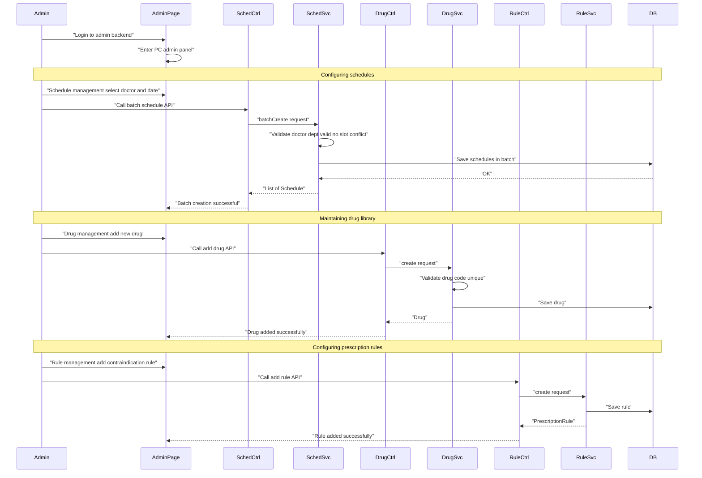

---

### 5.5 模块五：用户认证与通用基础设施模块

#### 5.5.1 模块概述

**负责人**：成员 E（最先完成，为其他模块提供基础）

**职责**：

- 三端认证：患者注册/登录、医生登录、管理员登录，JWT 签发与验证
- 患者信息查询与更新
- 通用基础设施：统一响应结构 Result、全局异常处理器、CORS 跨域配置、Swagger/Knife4j 文档
- 前端基础设施：Vite 项目创建、Axios 封装（请求/响应拦截器）、Vite 代理配置
- 联调支撑：JWT 自动携带、401 拦截跳转、跨域问题处理

**前置任务（项目初始化 F01-F06）**：Spring Boot 3 + Vue 3 项目脚手架、MySQL 配置、Knife4j、CORS、统一响应结构、Axios 封装

#### 5.5.2 类图

```mermaid
classDiagram
    direction TB

    class AuthController {
        +patientLogin(LoginRequest) Result_LoginResponse_
        +patientRegister(RegisterRequest) Result_Void_
        +doctorLogin(LoginRequest) Result_LoginResponse_
        +adminLogin(LoginRequest) Result_LoginResponse_
    }

    class PatientController {
        +getInfo() Result_PatientVO_
        +updateInfo(PatientUpdateRequest) Result_PatientVO_
    }

    class AuthService {
        +patientLogin(String username, String password) LoginResponse
        +patientRegister(RegisterRequest) void
        +doctorLogin(String username, String password) LoginResponse
        +adminLogin(String username, String password) LoginResponse
        -authenticate(String username, String password, UserDetails) boolean
        -generateToken(Long userId, String role) String
    }

    class JwtTokenUtil {
        +generateToken(Long userId, String role) String
        +validateToken(String token) boolean
        +getUserIdFromToken(String token) Long
        +getRoleFromToken(String token) String
    }

    class JwtAuthenticationFilter {
        +doFilterInternal(request, response, filterChain) void
        -extractToken(HttpServletRequest) String
        -setAuthenticationContext(Long userId, String role) void
    }

    class SecurityConfig {
        +securityFilterChain(HttpSecurity) SecurityFilterChain
        +passwordEncoder() PasswordEncoder
    }

    class ActorContext {
        +Long userId
        +String role "PATIENT/DOCTOR/ADMIN"
        +Long patientId "if role=PATIENT"
        +Long doctorId "if role=DOCTOR"
        +String username
        +boolean isPatient()
        +boolean isDoctor()
        +boolean isAdmin()
        +Long getRequiredPatientId()
        +Long getRequiredDoctorId()
    }

    class RolePolicy {
        <<interface>>
        +canViewMedicalRecord(ActorContext, Long targetPatientId) boolean
        +canSaveMedicalRecord(ActorContext, Long registrationId) boolean
        +canSubmitPrescription(ActorContext, Long registrationId) boolean
        +canViewDashboardAsDoctor(ActorContext, Long doctorId) boolean
        +canViewDashboardAsAdmin(ActorContext) boolean
        +canViewNotification(ActorContext, Long recipientId) boolean
    }

    class CorsConfig {
        +corsFilter() CorsFilter
        +addCorsMappings(CorsRegistry) void
    }

    class GlobalExceptionHandler {
        +handleBusinessException(BusinessException) Result
        +handleValidationException(MethodArgumentNotValidException) Result
        +handleAuthenticationException(AuthenticationException) Result
        +handleStateConflictException(StateConflictException) Result "new v3.0"
        +handleGenericException(Exception) Result
    }

    class PatientRepository {
        +findByUsername(String username) Optional
        +findByPhone(String phone) Optional
    }

    class DoctorRepository {
        +findByUsername(String username) Optional
    }

    class AdminRepository {
        +findByUsername(String username) Optional
    }

    AuthController --> AuthService : "calls"
    PatientController --> PatientService : "calls"
    AuthService --> JwtTokenUtil : "uses"
    AuthService --> PatientRepository : "uses"
    AuthService --> DoctorRepository : "uses"
    AuthService --> AdminRepository : "uses"
    JwtAuthenticationFilter --> JwtTokenUtil : "uses"
    GlobalExceptionHandler --> Result : "returns"
```

#### 5.5.3 核心时序图

**流程 A：患者登录 + JWT 认证**

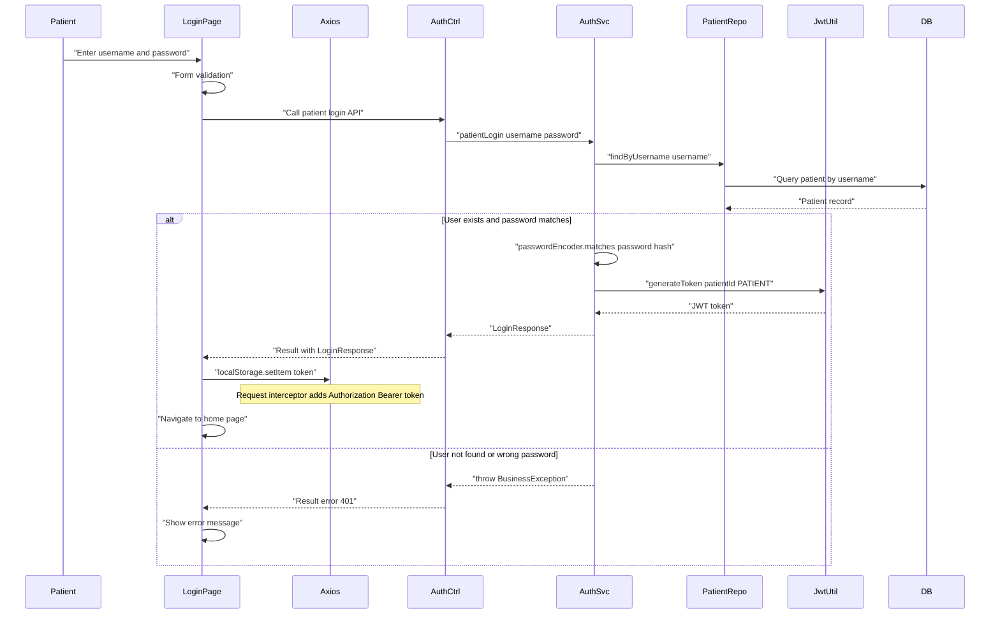

**流程 B：JWT 鉴权拦截流程**

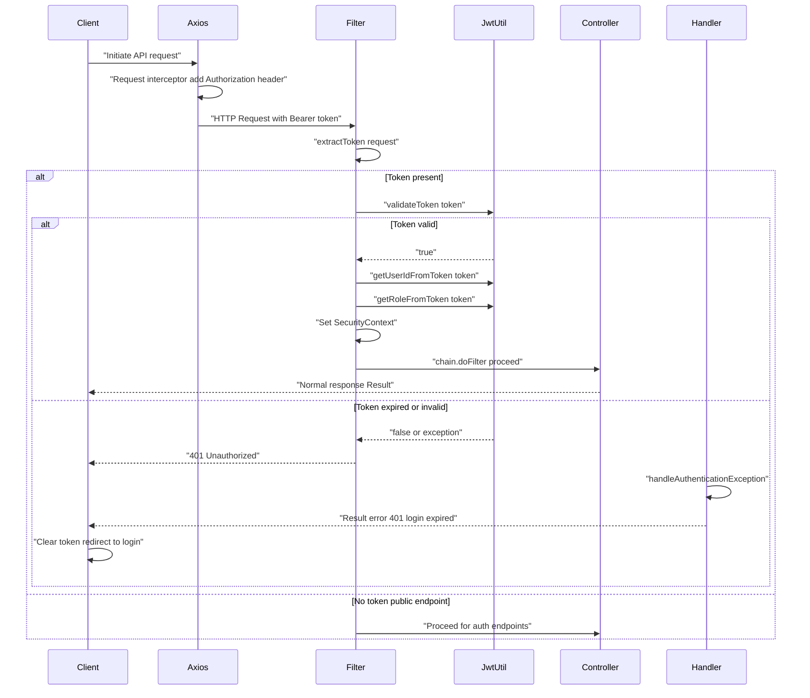

**流程 C：全局异常处理**

```mermaid
sequenceDiagram
    participant Ctrl
    participant Svc
    participant Handler

    Ctrl->>Svc: "Call business method"
    Svc->>Svc: "Business logic"

    alt Validation failure
        Svc-->>Ctrl: "throw BusinessException 400 invalid format"
        Ctrl-->>Handler: "Exception bubbles up"
        Handler->>Handler: "handleBusinessException"
        Handler-->>Ctrl: "Result error 400 message"
    else Not authenticated
        Ctrl-->>Handler: "throw AuthenticationException"
        Handler->>Handler: "handleAuthenticationException"
        Handler-->>Ctrl: "Result error 401 not logged in"
    else Unknown error
        Svc-->>Ctrl: "throw RuntimeException"
        Ctrl-->>Handler: "Exception bubbles up"
        Handler->>Handler: "handleGenericException log error"
        Handler-->>Ctrl: "Result error 500 internal server error"
    end
```

---

### 5.6 模块六：P1 进阶能力模块

#### 5.6.1 模块概述

**负责人**：由 P0 模块先完成的成员认领

**职责**：覆盖 PRD 中全部 P1/P2 能力——E01 AI 诊疗建议（`DiagnosisSuggestionService`）、E02 就诊评价与分诊准确度反馈（`VisitFeedback` + `TriageAccuracyFeedback`）、E03 数据可视化看板（医生端/管理端双视角 6 类 API）、E04 WebSocket 实时高风险用药告警（`RiskAlertPublisher` + `NotificationRecord`）、E05 SSE 流式病历与诊疗建议、E06 Pinia 状态机模块化、E07 可配置 Prompt 模板、E08 Nginx + Jar 双端部署、E09 Spring Cloud 四类 AI 微服务拆分、E10 远期 HIS 防腐层。

**子模块边界原则**：模块六不得让 P0 主链路直接依赖 WebSocket、SSE、看板、Spring Cloud 或真实 HIS。AI 建议子模块依赖问诊上下文和 AI 任务端口；反馈子模块依赖挂号完成状态和分诊业务记录；看板子模块只读 P0、反馈、通知和 AI 调用记录；实时通知子模块订阅处方审核风险事件并写通知记录；流式 AI 子模块用"创建会话 + EventSource 订阅"支撑病历和诊疗建议。

#### 5.6.2 类图（E01-E07 P1 能力）

```mermaid
classDiagram
    direction TB

    class AIDiagnosisController {
        +suggest(DiagnosisRequest) Result_DiagnosisListVO_
        +adopt(AdoptionRequest) Result_Void_
    }

    class DiagnosisSuggestionService {
        +suggest(String conversation, PatientInfo, Long registrationId) List_DiagnosisSuggestion_
        +adopt(Long suggestionId, AdoptionRequest, Long doctorId) void
        -buildPrompt(String conversation, PatientInfo) String
        -callLLMAPI(String prompt) String
        -parseSuggestions(String raw) List_DiagnosisSuggestion_
    }

    class DiagnosisSuggestionRecord {
        +Long id
        +Long registrationId
        +List_SuggestedDiagnosis_ suggestedDiagnoses
        +List_SuggestedExamItem_ suggestedExamItems "reference only"
        +String adoptionStatus
        +String finalDiagnosisDirection
        +Long aiCallRecordId
    }

    class SuggestedDiagnosis {
        +String diseaseName
        +String evidence
        +Double confidence
        +String riskNote
    }

    class SuggestedExamItem {
        +String examName
        +String reason
        +String priority
        +String relatedDisease
        +String displaySummary
    }

    class FeedbackController {
        +create(FeedbackRequest) Result_FeedbackVO_
        +getByRegistration(Long regId) Result_FeedbackVO_
        +listByPatient() Result_List_
    }

    class VisitFeedbackService {
        +create(FeedbackRequest, Long patientId) VisitFeedback
        +getByRegistration(Long regId) VisitFeedback
        +listByPatient(Long patientId) List
    }

    class VisitFeedback {
        +Long id
        +Long registrationId
        +Long patientId
        +int rating
        +String comment
        +TriageAccuracyFeedback triageAccuracy
    }

    class TriageAccuracyFeedback {
        +Long feedbackId
        +String recommendedDeptSnapshot
        +String actualDeptSnapshot
        +String accuracyLabel "ACCURATE/INACCURATE/UNCERTAIN"
        +String reasonTags
        +String notes
    }

    class DashboardController {
        +getOverview() Result_DashboardOverviewVO_
        +getTrends(Date from, Date to) Result_List_TrendPointVO_
        +getAIUsageStats(String scope) Result_AIUsageStatsVO_
        +getPrescriptionReviewRate(String scope) Result_PrescriptionReviewRateVO_
        +getRiskDistribution(String scope) Result_RiskDistributionVO_
        +getTriageAccuracy(String scope) Result_TriageAccuracyVO_
    }

    class DashboardQueryService {
        +getOverview(MetricScope) DashboardOverviewVO
        +getTrends(MetricScope, DateRange) List_TrendPointVO_
        +getAIUsageStats(MetricScope) AIUsageStatsVO
        +getPrescriptionReviewRate(MetricScope) PrescriptionReviewRateVO
        +getRiskDistribution(MetricScope) RiskDistributionVO
        +getTriageAccuracy(MetricScope) TriageAccuracyVO
    }

    class MetricScopePolicy {
        <<interface>>
        +resolveScope(ActorContext) MetricScope
        +getDoctorScope(Long doctorId) MetricScope
        +getAdminScope() MetricScope
    }

    class DashboardOverviewVO {
        +int todayRegistrations
        +int todayConsultations
        +int waitingCount
        +int completedCount
        +int todayPrescriptions
        +int todayAICalls
        +Date lastUpdated
    }

    class RiskAlertPublisher {
        +publishRiskAlert(PrescriptionReview, Registration) void
        -createRiskAlertEvent(PrescriptionReview) RiskAlertEvent
    }

    class RiskAlertEvent {
        +String alertType HIGH_RISK_PRESCRIPTION or REVIEW_UNCERTAIN_MANUAL_REQUIRED
        +Long registrationId
        +Long doctorId
        +String patientSummary
        +Long reviewId
        +String riskLevel
        +String ruleHitsSummary
    }

    class DoctorNotificationGateway {
        +pushRiskAlert(RiskAlertEvent, Long doctorId) void
        +pushAdminAlert(RiskAlertEvent) void
    }

    class NotificationRecord {
        +Long id
        +Long recipientId
        +String recipientRole
        +String alertType
        +String statisticsBucket
        +String displayLevel
        +Long businessRecordId
        +String patientSummary
        +String riskSummary
        +boolean isRead
    }

    class AIStreamSessionService {
        +createSession(StreamSessionRequest, ActorContext) StreamGenerationSession
        +getEvents(String sessionId, ActorContext) SseEmitter
        +cancelSession(String sessionId, ActorContext) void
    }

    class StreamGenerationSession {
        +String sessionId
        +String taskType MEDICAL_RECORD or DIAGNOSIS
        +Long operatorId
        +String status CREATING/STREAMING/COMPLETED/FAILED/CANCELLED
        +Date expiresAt
    }

    class RemoteAIServiceAdapter {
        +callRemoteAI(TriageAIRequestDTO) TriageAIResponseDTO
        +callRemoteAI(DiagnosisAIRequestDTO) DiagnosisAIResponseDTO
        +callRemoteAI(PrescriptionReviewAIRequestDTO) PrescriptionReviewAIResponseDTO
        +callRemoteAI(MedicalRecordAIRequestDTO) MedicalRecordAIResponseDTO
    }

    class AIServiceFallback {
        <<interface>>
        +fallbackForTriage(Exception, TriageAIRequestDTO) TriageAIResponseDTO
        +fallbackForDiagnosis(Exception, DiagnosisAIRequestDTO) DiagnosisAIResponseDTO
        +fallbackForReview(Exception, PrescriptionReviewAIRequestDTO) PrescriptionReviewAIResponseDTO
        +fallbackForMedicalRecord(Exception, MedicalRecordAIRequestDTO) MedicalRecordAIResponseDTO
    }

    class HISGateway {
        <<interface>>
        +mapPatientIdentity(String localPatientId) PatientIdentityResult
        +syncCheckoutOrder(OrderRequest) OrderSyncResult
        +syncExamLabOrder(ExamLabRequest) ExamLabSyncResult
        +syncPharmacyDispense(DispenseRequest) DispenseSyncResult
    }

    class DisabledHISGateway {
        +mapPatientIdentity(String localPatientId) PatientIdentityResult
        +syncCheckoutOrder(OrderRequest) OrderSyncResult
    }

    class HISSyncRecord {
        +Long id
        +String syncType
        +String idempotentKey
        +String externalId
        +String syncStatus
        +int retryCount
    }

    AIDiagnosisController --> DiagnosisSuggestionService : "calls"
    FeedbackController --> VisitFeedbackService : "calls"
    DashboardController --> DashboardQueryService : "calls"
    DashboardQueryService --> MetricScopePolicy : "uses"
    RiskAlertPublisher --> DoctorNotificationGateway : "calls"
    DiagnosisSuggestionService --> DiagnosisSuggestionRepository : "uses"
    VisitFeedbackService --> FeedbackRepository : "uses"
    DashboardQueryService --> RegistrationRepository : "uses"
    DashboardQueryService --> TriageRecordRepository : "uses"
    DashboardQueryService --> PrescriptionReviewRepository : "uses"
    DashboardQueryService --> FeedbackRepository : "uses"
    DiagnosisSuggestionService --> RemoteAIServiceAdapter : "uses"
    RemoteAIServiceAdapter --> AIServiceFallback : "uses"
    HISGateway <|.. DisabledHISGateway : "default implementation"
```

#### 5.6.3 核心时序图

**流程 A：AI 诊疗建议（P1）**

```mermaid
sequenceDiagram
    participant Doctor
    participant ConsultPage
    participant DiagCtrl
    participant DiagSvc
    participant LLM
    participant DiagRepo
    participant DB

    Doctor->>ConsultPage: "Enter conversation text"
    Doctor->>ConsultPage: "Click AI Diagnosis Suggestions P1"
    ConsultPage->>ConsultPage: "Show Loading"

    ConsultPage->>DiagCtrl: "Call diagnosis suggest API"
    DiagCtrl->>DiagSvc: "suggest conversation patientInfo"

    alt AI call succeeds
        DiagSvc->>LLM: "POST LLM API with prompt and conversation"
        LLM-->>DiagSvc: "Return diagnosis suggestions with confidence"
        DiagSvc->>DiagSvc: "parseSuggestions"
        DiagSvc->>DiagRepo: "save diagnosisRecord"
        DiagRepo->>DB: "Save diagnosis record"
        DiagSvc-->>DiagCtrl: "List of DiagnosisSuggestion"
        DiagCtrl-->>ConsultPage: "Result with DiagnosisListVO"
        ConsultPage->>ConsultPage: "Show suggestion cards with confidence scores"
    else AI call fails
        DiagSvc-->>DiagCtrl: "Fallback result"
        DiagCtrl-->>ConsultPage: "AI suggestion unavailable please judge manually"
        ConsultPage->>ConsultPage: "Show fallback hint"
    end
```

**流程 B：就诊评价（P1）**

```mermaid
sequenceDiagram
    participant Patient
    participant RegDetail
    participant FbCtrl
    participant FbSvc
    participant FbRepo
    participant DB

    Patient->>RegDetail: "View completed registration click Evaluate"
    RegDetail->>RegDetail: "Show evaluation form rating stars triage accuracy feedback"

    Patient->>RegDetail: "Submit 5-star rating plus triage accuracy yes"
    RegDetail->>FbCtrl: "Call feedback create API"
    FbCtrl->>FbSvc: "create request"
    FbSvc->>FbSvc: "Validate registration is completed"
    FbSvc->>FbRepo: "save feedback"
    FbRepo->>DB: "Save feedback"

    FbSvc-->>FbCtrl: "Feedback"
    FbCtrl-->>RegDetail: "Result ok"
    RegDetail->>RegDetail: "Evaluation submitted successfully"
```

**流程 C：ECharts 数据看板（P1）**

```mermaid
sequenceDiagram
    participant Doctor
    participant Dashboard
    participant DashCtrl
    participant DashSvc
    participant RegRepo
    participant TriageRepo
    participant ReviewRepo
    participant FbRepo
    participant DB

    Doctor->>Dashboard: "Enter doctor dashboard"
    Dashboard->>Dashboard: "Show Loading"

    Dashboard->>DashCtrl: "Request dashboard overview"
    DashCtrl->>DashSvc: "getOverview doctorId"
    DashSvc->>RegRepo: "countByDoctorIdAndDate"
    RegRepo->>DB: "Count registrations"
    DB-->>RegRepo: "Count result"
    DashSvc-->>DashCtrl: "DashboardOverview"
    DashCtrl-->>Dashboard: "Result overview data"

    Dashboard->>DashCtrl: "Request AI usage stats"
    DashCtrl->>DashSvc: "getAIUsageStats doctorId"
    DashSvc->>TriageRepo: "count triage calls"
    DashSvc->>ReviewRepo: "count review calls"
    DashSvc->>DB: "Aggregate AI usage"
    DashSvc-->>DashCtrl: "AIUsageStats"
    DashCtrl-->>Dashboard: "Result AI usage data"

    Dashboard->>DashCtrl: "Request risk distribution"
    DashCtrl->>DashSvc: "getPrescriptionRiskDist doctorId"
    DashSvc->>ReviewRepo: "countByRiskLevel"
    ReviewRepo->>DB: "Count prescriptions by risk level"
    DB-->>ReviewRepo: "Risk distribution"
    DashSvc-->>DashCtrl: "RiskDistribution"
    DashCtrl-->>Dashboard: "Result risk distribution"

    Dashboard->>DashCtrl: "Request triage accuracy"
    DashCtrl->>DashSvc: "getTriageAccuracy"
    DashSvc->>FbRepo: "countByTriageAccurate"
    FbRepo->>DB: "Count feedback by accuracy"
    DB-->>FbRepo: "Accuracy counts"
    DashSvc-->>DashCtrl: "TriageAccuracyVO"
    DashCtrl-->>Dashboard: "Result triage accuracy"

    Dashboard->>Dashboard: "Render ECharts pie chart bar chart cards"
```

#### 5.6.4 E04 WebSocket 高风险用药实时告警

- **WebSocket 配置**：STOMP over WebSocket，握手路径 `/ws`，JWT 由 Authorization 头或受限场景短期 token 传递
- **订阅路由**：医生订阅 `/user/queue/risk-alerts`，管理员订阅 `/user/queue/risk-alerts` 或 `/topic/admin/risk-alerts`
- **事件类型**：`RiskAlertType.HIGH_RISK_PRESCRIPTION`（明确高风险）与 `RISK_UNCERTAIN_MANUAL_REQUIRED`（规则不可用/上下文缺失需人工确认）分离；`UNKNOWN` 不得并入 `HIGH` 统计
- **推送保证**：`NotificationRecord` 写入与推送解耦，推送失败不回滚处方审核；前端重连后通过未读 API `GET /api/notifications/unread` 补拉
- **鉴权**：越权订阅和伪造 doctorId/topic 的连接必须拒绝

#### 5.6.5 E05 SSE 流式病历生成与诊疗建议

- **方案**：Spring MVC `SseEmitter`，"POST 创建会话 + GET EventSource 订阅"
- **会话模型**：`POST /api/ai-stream-sessions` 创建 `StreamGenerationSession`，绑定 taskType（MEDICAL_RECORD/DIAGNOSIS）、短期 token；`GET /api/ai-stream-sessions/{id}/events` 返回 SseEmitter 事件流；`DELETE /api/ai-stream-sessions/{id}` 取消
- **事件类型**：`CHUNK`（流式内容）、`DONE`（完成，携带完整结果引用）、`ERROR`（失败/降级）、`TIMEOUT`（超时）
- **降级**：超时/取消/中断通过事件返回；失败可退回普通 POST；流式草稿不自动保存正式记录

#### 5.6.6 E06 Pinia 状态机模块化

- **Store 清单**：`useAuthStore`、`usePatientStore`、`useDoctorStore`、`useAdminStore`、`useRegistrationStore`、`useScheduleStore`、`useDrugStore`、`usePrescriptionStore`、`useMedicalRecordStore`、`useAIStore`、`useDashboardStore`、`useNotificationStore`
- **设计规范**：每个 Store 必须有 loading、error、degraded、lastLoadedAt 等价状态；只维护前端交互状态和后端 VO 缓存，不承担权威业务状态推进；关键枚举来自后端类型契约（`src/types/api.ts`）

#### 5.6.7 E07 可配置 Prompt 模板

- **模板管理**：`PromptTemplateService` 按 taskType + deptCode 查询模板，变量白名单校验（`{{dept}}`、`{{age}}`、`{{gender}}`、`{{diagnosis}}`）
- **版本化策略**：AI 调用使用渲染时确定的模板版本，不受管理员随后编辑影响；模板变量非法或缺失默认模板时任务降级并使用内置默认模板，记录 `AICallRecord.promptVersion`

#### 5.6.8 E08 Nginx + Jar 双端部署

- **部署架构**：Vite 构建产物 → `dist/` → Nginx 静态资源；`mvn package` → `.jar` → `java -jar`；Nginx `proxy_pass` 转发 `/api/` 到后端 Jar
- **Profile 管理**：`application-prod.yml` 管理 CORS origin、日志级别、数据库连接、敏感配置来源；生产演示不允许页面或日志明文展示 API Key
- **健康检查**：`GET /api/health` 返回服务状态、数据库连通性、AI provider 健康摘要

#### 5.6.9 E09 Spring Cloud 微服务拆分

- **微服务边界**：四类 AI 微服务——`triage-ai-service`、`diagnosis-ai-service`、`prescription-review-ai-service`、`medical-record-ai-service`
- **核心服务职责**：仍对前端暴露原 P0/P1 API；AI 微服务只暴露内部接口 `/internal/ai/v1/**`
- **内部接口矩阵**（见第 7.3 节 E09 微服务接口矩阵）
- **服务治理**：Nacos 注册中心 + Spring Cloud Feign + Sentinel 熔断；内部鉴权用服务间凭据（`X-Internal-Token`），不是用户 JWT 透传
- **数据归属**：核心服务本地写 `AICallRecord` 和业务记录（`TriageRecord`、`MedicalRecord`、`DiagnosisSuggestionRecord`、`PrescriptionReview`），不引入分布式事务

#### 5.6.10 E10 远期 HIS 防腐层

- **防腐层接口**：`HISGateway`——患者主索引映射、收费/退费、检查检验医嘱、发药/退药、药库交易
- **默认实现**：`DisabledHISGateway` 返回"未启用/模拟"状态，不阻断 P0/P1
- **同步记录**：`HISSyncRecord` 以幂等键管理外部一致性，同步失败进入待重试/失败/待人工处理
- **E01 建议检查项目边界**：`SuggestedExamItem` 只有参考语义，医生若需开立检查检验必须进入独立操作并通过 `ExamLabOrderBoundary` 创建外部医嘱

---

## 6. API 接口总览

### 模块五——认证与患者管理

| 方法 | 路径                           | 说明         | 鉴权    |
| ---- | ------------------------------ | ------------ | ------- |
| POST | `/api/auth/patient/register` | 患者注册     | 否      |
| POST | `/api/auth/patient/login`    | 患者登录     | 否      |
| POST | `/api/auth/doctor/login`     | 医生登录     | 否      |
| POST | `/api/auth/admin/login`      | 管理员登录   | 否      |
| GET  | `/api/patient/info`          | 获取患者信息 | PATIENT |
| PUT  | `/api/patient/info`          | 更新患者信息 | PATIENT |

### 模块一——智能分诊与挂号

| 方法 | 路径                              | 说明                       | 鉴权    |
| ---- | --------------------------------- | -------------------------- | ------- |
| POST | `/api/triage/consult`           | AI 智能分诊                | PATIENT |
| GET  | `/api/triage/history`           | 分诊历史                   | PATIENT |
| GET  | `/api/departments`              | 科室列表（公开）           | 否      |
| GET  | `/api/departments/{id}`         | 科室详情（公开）           | 否      |
| GET  | `/api/doctors`                  | 医生列表按科室筛选（公开） | 否      |
| GET  | `/api/doctors/{id}`             | 医生详情（公开）           | 否      |
| GET  | `/api/schedules/available`      | 可用号源                   | PATIENT |
| POST | `/api/registration/create`      | 创建挂号（扣减号源）       | PATIENT |
| GET  | `/api/registration/list`        | 我的挂号列表               | PATIENT |
| PUT  | `/api/registration/cancel/{id}` | 取消挂号（释放号源）       | PATIENT |

### 模块二——AI 病历生成

| 方法 | 路径                                      | 说明                                     | 鉴权           |
| ---- | ----------------------------------------- | ---------------------------------------- | -------------- |
| POST | `/api/medical-record/generate`          | AI 生成病历草稿（回填可编辑表单）          | DOCTOR         |
| POST | `/api/medical-record/save`              | 保存正式病历（推进到 MEDICAL_RECORD_SAVED，可开方） | DOCTOR         |
| GET  | `/api/medical-record/{id}`              | 病历详情                                 | DOCTOR/PATIENT |
| GET  | `/api/medical-record/list/patient/{id}` | 患者病历列表                             | DOCTOR/PATIENT |
| GET  | `/api/medical-record/list/doctor`       | 医生病历列表                             | DOCTOR         |
| GET  | `/api/medical-record/search`            | 搜索病历                                 | DOCTOR         |
| POST | `/api/consultation/{registrationId}/begin` | 医生开始接诊（推进到 IN_CONSULTATION） | DOCTOR       |
| GET  | `/api/consultation/{registrationId}/workspace` | 获取问诊工作区（含当前可执行动作）  | DOCTOR       |
| POST | `/api/consultation/{registrationId}/complete` | 医生结束就诊（推进到 COMPLETED） | DOCTOR       |

### 模块三——处方审核与开具

| 方法 | 路径                                    | 说明                                                 | 鉴权           |
| ---- | --------------------------------------- | ---------------------------------------------------- | -------------- |
| POST | `/api/prescription/check`             | AI 处方审核（本地规则+LLM），返回 reviewId/riskLevel/ruleHits/snapshotHash | DOCTOR         |
| POST | `/api/prescription/submit`            | 提交处方（需携带 reviewId，后端重算快照哈希比对）       | DOCTOR         |
| GET  | `/api/prescription/list/patient/{id}` | 患者处方列表                                         | DOCTOR/PATIENT |
| GET  | `/api/prescription/list/doctor`       | 医生处方列表                                         | DOCTOR         |
| GET  | `/api/prescription/{id}`              | 处方详情（含审核绑定状态）                              | DOCTOR/PATIENT |
| GET  | `/api/prescription/{id}/review`       | 审核详情（规则命中+LLM解释+人工确认）                  | DOCTOR/PATIENT |
| GET  | `/api/drugs/search`                   | 医生端搜索药品（仅上架，支持名称/拼音码/适应症）        | DOCTOR         |

**处方审核响应关键字段**：`reviewId`、`reviewStatus`、`ruleEngineStatus`（SUCCESS/UNAVAILABLE/CONTEXT_MISSING）、`riskLevel`（LOW/MEDIUM/HIGH/UNKNOWN）、`ruleHits[]`（含 ruleId/ruleType/riskLevel/alertMessage/suggestion/basisSnapshot）、`llmSuggestion`、`llmCallStatus`、`prescriptionSnapshotHash`、`reviewContextHash`、`contextMissingItems[]`、`degraded`（布尔）

### 模块四——管理端

| 方法               | 路径                                          | 说明               | 鉴权  |
| ------------------ | --------------------------------------------- | ------------------ | ----- |
| GET/POST/PUT/PATCH | `/api/admin/departments/**`                 | 科室 CRUD          | ADMIN |
| GET/POST/PUT/PATCH | `/api/admin/doctors/**`                     | 医生 CRUD          | ADMIN |
| GET/POST/PUT/PATCH | `/api/admin/schedules/**`                   | 排班号源管理含批量 | ADMIN |
| GET/POST/PUT/PATCH | `/api/admin/drugs/**`                       | 药品库管理         | ADMIN |
| GET/POST/PUT/PATCH | `/api/admin/prescription-rules/**`          | 处方规则定义管理（含 RuleBasis 结构） | ADMIN |
| GET/PUT            | `/api/admin/ai-config/**`                   | AI 配置管理（API Key 只写不回显）     | ADMIN |
| GET/POST/PUT        | `/api/admin/prompt-templates/**`            | Prompt 模板管理（E07）                 | ADMIN |
| GET                | `/api/admin/ai-records/triage`              | AI 分诊记录追溯（AdminTriageRecordVO） | ADMIN |
| GET                | `/api/admin/ai-records/medical-record`      | AI 病历生成记录追溯（AdminMRRecordVO） | ADMIN |
| GET                | `/api/admin/ai-records/prescription-review` | AI 处方审核记录追溯（AdminPReviewRecordVO） | ADMIN |
| GET/POST            | `/api/admin/his-sync/**`                    | HIS 同步记录查询/重试（E10）            | ADMIN |

### 模块六——P1 进阶能力

| 方法 | 路径 | 说明 | 鉴权 |
| ---- | ---- | ---- | ---- |
| POST | `/api/diagnosis/suggest` | AI 诊疗建议（E01，返回 SuggestedDiagnosis + SuggestedExamItem） | DOCTOR |
| POST | `/api/diagnosis/adopt` | 采纳诊疗建议（E01，写回采纳状态和最终诊断方向） | DOCTOR |
| POST | `/api/feedback/create` | 提交就诊评价（E02，仅 COMPLETED 后，同一挂号唯一一条） | PATIENT |
| GET | `/api/feedback/registration/{id}` | 查询评价（E02，含分诊准确度反馈 TriageAccuracyFeedback） | PATIENT |
| GET | `/api/dashboard/overview` | 看板概览（E03，DashboardOverviewVO，支持 scope=doctor\|admin） | DOCTOR/ADMIN |
| GET | `/api/dashboard/trends` | 智能趋势（E03，TrendPointVO[]，支持日期范围） | DOCTOR/ADMIN |
| GET | `/api/dashboard/ai-usage` | AI 使用率统计（E03，四类 AI 使用次数/成功率/耗时，按任务类型筛选） | DOCTOR/ADMIN |
| GET | `/api/dashboard/prescription-review-rate` | 处方审核通过率（E03，通过数/中高风险/人工确认/未知/通过率） | DOCTOR/ADMIN |
| GET | `/api/dashboard/risk-distribution` | 风险分布（E03，LOW/MEDIUM/HIGH/UNKNOWN 数量和比例，UNKNOWN 单独桶） | DOCTOR/ADMIN |
| GET | `/api/dashboard/triage-accuracy` | 分诊准确率（E03，基于 VisitFeedback+TriageAccuracyFeedback+TriageRecord） | DOCTOR/ADMIN |
| GET | `/api/notifications/unread` | 未读通知补拉（E04，WebSocket 推送失败后的补拉机制） | DOCTOR/ADMIN |
| PUT | `/api/notifications/{id}/read` | 标记通知已读（E04） | DOCTOR/ADMIN |
| POST | `/api/ai-stream-sessions` | 创建 SSE 流式会话（E05，返回 sessionId + 短期 token） | DOCTOR |
| GET | `/api/ai-stream-sessions/{id}/events` | SSE EventSource 订阅流式事件（E05） | DOCTOR |
| DELETE | `/api/ai-stream-sessions/{id}` | 取消流式会话（E05） | DOCTOR |

**看板 VO 契约**（E03 双视角）：
- `DashboardOverviewVO`：今日挂号数、今日就诊数、待接诊数、已完成数、今日处方数、今日 AI 调用数、更新时间。医生看本人，管理看全院，无数据返回 0
- `TrendPointVO`：日期/月、挂号数、就诊数、处方数、AI 调用数。缺失日期补 0
- `AIUsageStatsVO`：四类 AI（分诊/病历/处方审核/诊疗建议）使用次数、成功次数、失败/降级次数、使用率、平均耗时
- `PrescriptionReviewRateVO`：审核总数、通过/低风险数、中高风险数、人工确认数、未知数、审核通过率。UNKNOWN 不计入低风险通过
- `RiskDistributionVO`：LOW/MEDIUM/HIGH/UNKNOWN 数量和比例，UNKNOWN 单独桶不并入 HIGH
- `TriageAccuracyVO`：反馈总数、准确数、不准确数、准确率、无反馈数。无反馈时准确率为空并标注样本数

**读侧追溯 VO 契约**（三端共用）：
- `AdminTriageRecordVO`：时间范围、患者摘要（脱敏）、推荐科室/医生快照、推荐来源、AI 状态、降级状态、挂号关联
- `PatientPrescriptionListVO/DetailVO`：就诊日期、医生/科室快照、药品摘要、风险等级、审核建议患者可读说明
- `PatientMedicalRecordListVO/DetailVO`：就诊日期、医生/科室、主诉/诊断摘要、挂号状态。隐藏 AI 技术细节
- `DoctorPrescriptionHistoryVO`：患者摘要、诊断方向、药品摘要、风险等级、审核绑定状态
- `DoctorReviewDetailVO`：规则命中快照、风险等级、LLM 解释、上下文缺失项、人工确认说明、快照哈希摘要
- `NotificationRecordVO`：告警类型、统计桶、展示级别、患者摘要、风险摘要、已读状态

### 统一响应格式

```json
{"code": 200, "message": "success", "data": {...}, "timestamp": 1718323200000}
{"code": 400, "message": "validation error", "data": null, "timestamp": 1718323200000}
{"code": 401, "message": "login expired please re-login", "data": null, "timestamp": 1718323200000}
{"code": 500, "message": "internal server error", "data": null, "timestamp": 1718323200000}
```

---

## 7. AI 服务集成设计

### 7.1 AI Provider 抽象层

```mermaid
classDiagram
    direction TB

    class AIProvider {
        <<interface>>
        +chat(String prompt, String systemMessage) String
        +chatStream(String prompt, String systemMessage) Flux_String_
        +getProviderName() String
    }

    class TongYiProvider {
        +chat(String prompt, String systemMessage) String
        +chatStream(String prompt, String systemMessage) Flux_String_
        +getProviderName() String
    }

    class DouBaoProvider {
        +chat(String prompt, String systemMessage) String
        +chatStream(String prompt, String systemMessage) Flux_String_
        +getProviderName() String
    }

    class AIProviderFactory {
        +getProvider(String providerName) AIProvider
        +getDefaultProvider() AIProvider
    }

    class AITriageService {
        -AIProvider aiProvider
        +consult(String complaint) TriageResult
    }

    class AIMedicalRecordService {
        -AIProvider aiProvider
        +generate(String conversation, String diagnosis, PatientInfo) StructuredMR
    }

    class PrescriptionReviewService {
        -AIProvider aiProvider
        +review(PrescriptionCheckRequest) ReviewResult
    }

    class AIDiagnosisService {
        -AIProvider aiProvider
        +suggest(String conversation, PatientInfo) DiagnosisList
    }

    AIProvider <|.. TongYiProvider : "implements"
    AIProvider <|.. DouBaoProvider : "implements"
    AIProviderFactory --> AIProvider : "creates"

    AITriageService --> AIProviderFactory : "uses"
    AIMedicalRecordService --> AIProviderFactory : "uses"
    PrescriptionReviewService --> AIProviderFactory : "uses"
    AIDiagnosisService --> AIProviderFactory : "uses"
```

**关键设计**：

- `AIProvider` 接口定义统一 `chat` / `chatStream` 方法，所有供应商对业务层透明
- `AIProviderFactory` 按 `AIConfig` 表配置动态创建实例
- 切换供应商：修改 `AIConfig.provider` 字段值 + 重启即可
- 前端永不接触 API Key

### 7.2 处方审核双引擎架构

```
+--------------------------------------------------+
|          PrescriptionReviewService                |
|                                                  |
|  +---------------------+  +------------------+   |
|  |   LocalRuleEngine   |  |   LLM Reviewer   |   |
|  |                     |  |                  |   |
|  | * Allergy conflict  |  | * Rule hit explain|   |
|  | * Contraindication  |  | * Supplementary  |   |
|  | * Drug interaction  |  |   suggestions    |   |
|  | * Dosage range      |  | * Risk summary   |   |
|  | * Duplicate drug    |  | * Uncertainty    |   |
|  | * Disease contra    |  |   annotation     |   |
|  | * Duration anomaly  |  |                  |   |
|  +---------------------+  +------------------+   |
|           |                       |              |
|           v                       v              |
|    Deterministic check    Explanatory enhancement|
|    (No LLM dependency)    (LLM optional)         |
+--------------------------------------------------+
```

### 7.3 E09 微服务接口矩阵

E09 拆分采用核心服务 + 四类 AI 微服务。核心服务仍对前端暴露原 P0/P1 API，AI 微服务只暴露内部接口 `/internal/ai/v1/**`。每次远程调用由核心服务生成 traceId/requestId，并在本地 `AICallRecord` 保存远程响应摘要和降级状态。

| serviceId | 内部路径 | Feign Client | 入参 DTO | 出参 DTO | 本地业务落点 |
|---|---|---|---|---|---|
| `triage-ai-service` | `POST /internal/ai/v1/triage/recommend` | `TriageAIInternalClient` | `TriageAIRequestDTO`：症状摘要、患者年龄/性别、候选科室医生摘要、prompt 版本、traceId | `TriageAIResponseDTO`：推荐科室、推荐医生候选、推荐理由、置信/排序、模型摘要、降级状态 | 核心服务写 `AICallRecord` 与 `TriageRecord` |
| `diagnosis-ai-service` | `POST /internal/ai/v1/diagnosis/suggest` | `DiagnosisAIInternalClient` | `DiagnosisAIRequestDTO`：问诊文本、主诉、初步诊断、患者摘要、科室、traceId | `DiagnosisAIResponseDTO`：疾病建议列表、依据、建议检查项目、置信/排序、模型摘要、降级状态 | 核心服务写 `AICallRecord` 与 `DiagnosisSuggestionRecord` |
| `prescription-review-ai-service` | `POST /internal/ai/v1/prescription-review/explain` | `PrescriptionReviewAIInternalClient` | `PrescriptionReviewAIRequestDTO`：处方快照、本地规则命中、患者用药上下文、风险等级、traceId | `PrescriptionReviewAIResponseDTO`：解释建议、风险摘要、调整建议、降级状态 | 核心服务写 `AICallRecord` 并合并到 `PrescriptionReview.llmExplanationSnapshot` |
| `medical-record-ai-service` | `POST /internal/ai/v1/medical-record/generate` | `MedicalRecordAIInternalClient` | `MedicalRecordAIRequestDTO`：问诊文本、诊断方向、患者摘要、科室模板、traceId | `MedicalRecordAIResponseDTO`：结构化病历草稿、字段置信/缺失提示、降级状态 | 核心服务写 `AICallRecord` 并返回 `MedicalRecordDraft` |

**统一内部错误响应**：`errorCode`、`message`、`fallbackStatus`（映射到 `AIFallbackStatus`）、`retryable`、`traceId`、`remoteServiceId`。Feign 层将 401/403 → 内部鉴权失败、408/超时 → `AI_TIMEOUT`、5xx/熔断 → `REMOTE_AI_UNAVAILABLE`、业务解析错误 → `AI_PARSE_FAILED`。

**超时与重试**：四类默认超时 15-30 秒；重试仅对网络瞬断/5xx 有限重试，不对非幂等 4xx 重试；熔断打开后直接走 `AIServiceFallback`。

**内部鉴权头**：`X-Internal-Service`、`X-Internal-Token`、`X-Trace-Id`、`X-Request-Id`、`X-Task-Type`。前端不可直接访问 `/internal/ai/v1/**`。核心服务使用服务间凭据而非用户 JWT 透传。

---

## 8. 安全设计

| 层次 | 措施 | 说明 |
| ---- | ---- | ---- |
| 传输层 | HTTPS 生产 / HTTP 开发 | Nginx 反向代理 + SSL |
| 认证层 | JWT + BCrypt | Token 24h 有效期，密码 BCrypt 加密 |
| 鉴权层 | RBAC + `ActorContext` + `RolePolicy` | PATIENT / DOCTOR / ADMIN；所有业务判断基于 `ActorContext`，不信任前端传入的 patientId/doctorId |
| 数据层 | API Key AES 加密存储 + `SecretCipher` | API Key 只写不回显，密钥版本化轮换，管理端 VO 脱敏显示（掩码） |
| 应用层 | `@Valid` + JPA 参数绑定 | 防 SQL 注入；输入校验在 Controller 层完成 |
| 前端 | localStorage + Axios 拦截器 | 401 自动跳登录；前端不接触 API Key、完整 Prompt 或管理端规则内部编辑信息 |
| 日志 | 敏感信息脱敏 | 日志不记录明文 API Key、完整 Prompt 中的敏感患者信息、JWT token |
| AI 配置 | `AIConfig` 聚合管理 | API Key 加密只写；健康检查失败只影响可用性不删除配置；配置版本化 |
| Prompt 模板 | 变量白名单 + 版本化 | 变量非法拒绝启用；API Key 和敏感隐私不入模板或前端；渲染时版本确定不受后续编辑影响 |
| WebSocket | JWT 握手鉴权 + 订阅隔离 | 越权订阅和伪造 doctorId/topic 的连接必须拒绝；用户队列隔离 |
| SSE | 短期 stream token | 会话绑定任务类型和操作者；超时/取消/中断通过事件返回 |
| E09 微服务 | 服务间凭据（`X-Internal-Token`） | 内部接口不暴露给前端；核心服务不透传用户 JWT；内部鉴权失败映射为降级 |
| 状态机 | 后端 `RegistrationLifecyclePolicy` 兜底 | 前端按钮置灰只改善体验；后端以策略模式兜底所有状态推进 |
| 处方规则 | 管理员可写，患者端不可读规则内部配置 | 规则依据可展示但编辑信息仅管理端可见 |

---

## 9. 并发设计

**号源扣减**：使用数据库条件更新（`WHERE remaining_slots > 0` + 乐观锁版本号），确保剩余号源不为负。挂号创建与扣减在同一事务内完成；重复挂号通过 `(patient_id, schedule_id)` 唯一约束（排除 `CANCELLED`）保证。

**取消挂号与号源释放**：在一个短事务内完成，以 `slot_released` 标记和状态条件保证只释放一次。取消后允许患者按业务规则重新挂号。

**状态推进**：医生开始接诊、保存病历、处方审核、提交处方和完成就诊都通过 `RegistrationLifecyclePolicy` 做状态条件更新，使用版本号条件更新（`WHERE version = :oldVersion`）避免并发丢失更新。

**AI 配置更新**：短事务。默认 Provider 设置通过唯一约束保证同一 `task_scope` 只有一个默认启用配置。运行中的 AI 调用使用解析时确定的配置版本。

**规则定义版本**：启用新版本只影响新审核，历史 `PrescriptionReview` 通过 `RuleHit` 快照保留当时规则版本和依据。规则执行组件无状态或只读缓存，避免并发审核互污染。

**处方审核与提交**：快照哈希绑定。审核记录创建后处于 `UNBOUND` 状态；提交时后端重算快照并比对哈希。若医生修改处方项、诊断方向或患者上下文，旧审核过期必须重新审核。一个审核记录最多绑定一个处方。

**WebSocket 通知**：`NotificationRecord` 写入与推送解耦，推送失败不回滚审核事务。已读状态更新是独立短事务。

**SSE 会话**：设置过期、空闲超时、最大输出限制和取消状态，避免浏览器连接长期占用线程。

**E09 微服务**：不使用分布式事务。核心业务服务以本地数据库为事实来源；远程 AI 调用结果只作为输入。E10 HIS 同步以幂等键管理外部一致性。

---

## 10. 错误处理策略

**业务异常与状态冲突**：输入校验错误、权限错误、状态流转错误和业务不变量冲突使用业务异常 → 统一响应（`ResultEnvelope`）。状态机错误统一归类为 `StateConflictException`（HTTP 409），返回明确错误码和可执行动作提示。

**幂等场景**：重复开始接诊、重复取消、重复结束就诊、重复提交处方等返回现有资源或明确"已处理"状态，不得重复扣号、释放号源或绑定审核。

**AI 降级状态**（写入 `AICallRecord` 并投影到业务 VO）：

| 降级状态 | 映射场景 |
|---|---|
| `AI_DISABLED` | 配置缺失、禁用、密钥缺失或配置校验失败 |
| `AI_TIMEOUT` | 超过配置超时（默认 15-30 秒） |
| `REMOTE_AI_UNAVAILABLE` | 供应商不可达、5xx、鉴权失败或熔断打开 |
| `AI_PARSE_FAILED` | 输出格式无法解析 |

**处方规则错误**：配置校验失败的规则不能启用；运行失败使审核进入 `UNKNOWN/MANUAL_REQUIRED`；上下文缺失返回缺失项列表，允许医生补充并重审。规则不可用不得返回低风险。

**看板错误**：查询参数错误返回明确提示；越权范围被拒绝；某指标无数据返回零值结构；聚合异常返回整体错误。`UNKNOWN`、人工确认、高风险三个统计语义必须分离。

**拓展能力降级**：WebSocket 推送失败保留通知记录；SSE 中断可退回普通 POST；看板无数据返回零值；评价重复提交返回已评价或幂等；Prompt 模板非法拒绝启用；远程 AI 失败写降级；HIS 失败写同步记录。

**安全边界错误**：API Key 不回显；密钥解密失败视为配置不可用 → `AI_DISABLED`；日志不记录明文密钥、完整 Prompt 中患者敏感信息或 JWT token。

---

## 11. 设计决策

1. **模块化单体 + P0 基线**：课程项目更需要可运行、可讲解、可本地联调的闭环；E09 通过任务端口和适配器预留，不冲击 P0 本地演示
2. **`Registration` 作为诊疗闭环锚点**：用闭合状态机替代含混的"完成"语义，保存病历只推进到 `MEDICAL_RECORD_SAVED`，就诊完成由处方提交或医生结束就诊触发
3. **读侧 VO 作为架构契约**：管理端三类 AI 记录、患者处方/病历、医生历史处方/审核详情、看板 VO 必须与 OOD 同步定义，前后端共用一份 TypeScript 类型契约
4. **`AIConfig` 作为 P0 管理端配置聚合**：不是简单环境变量，而是可管理、可审计、可降级的完整配置实体
5. **`PrescriptionRuleDefinition`、`RuleBasis` 与 `RuleDefinitionCompiler` 分离**：管理端维护可读、可版本化、可解释的规则定义；规则引擎消费已编译的运行时规则
6. **本地规则优先，LLM 解释增强**：LLM 不可用不阻断本地规则结果；规则不可用不能伪装低风险
7. **`UNKNOWN` 与 `HIGH` 分离统计**：通过 `RiskAlertType`、`statisticsBucket` 和看板读侧规则拆分，不污染风险分布
8. **E03 看板读侧聚合**：不通过写事务实时维护复杂统计，P1 不反向阻塞 P0 主链路
9. **E09 四类 AI 微服务边界**：分别为 triage、diagnosis、prescription-review、medical-record，内部接口矩阵支撑独立编码与联调
10. **E01 建议检查项目仅为参考**：检查检验属远期 HIS 边界，不因 AI 采纳动作误创建检查医嘱
11. **SSE 采用 MVC SseEmitter**：POST 建会话 + GET EventSource 订阅，适配 Spring Boot 3 MVC/REST 栈
12. **HIS 防腐层**：收费、检查检验、发药、药库交易、外部患者主索引通过网关和同步记录远期落点，`DisabledHISGateway` 或 Mock 不影响 P0 演示

---

## 附录：前端 TypeScript 类型同步清单

以下类型必须进入 `src/types/api.ts` 和 `src/types/enums.ts`，页面不得以 `any` 或松散字符串消费关键状态：

- **枚举**：`RegistrationStatus`、`AvailableAction`、`AIConfigStatus`、`AIFallbackStatus`、`RuleType`、`RuleEngineStatus`、`RiskAlertType`
- **配置 VO**：`AdminAIConfigVO`、`AdminAIConfigWriteDTO`
- **规则 VO**：`RuleBasisVO`、`PrescriptionRuleDefinitionVO`、`RuleConditionVO`、`RuleHitVO`
- **处方审核 VO**：`PrescriptionReviewVO`、`ReviewResultVO`
- **看板 VO**：`DashboardOverviewVO`、`AIUsageStatsVO`、`PrescriptionReviewRateVO`、`RiskDistributionVO`、`TriageAccuracyVO`、`TrendPointVO`
- **管理端追溯 VO**：`AdminTriageRecordVO`、`AdminMedicalRecordAIRecordVO`、`AdminPrescriptionReviewRecordVO`
- **患者端 VO**：`PatientPrescriptionListVO`、`PatientPrescriptionDetailVO`、`PatientMedicalRecordListVO`、`PatientMedicalRecordDetailVO`
- **医生端 VO**：`DoctorPrescriptionHistoryVO`、`DoctorReviewDetailVO`
- **通知 VO**：`RiskAlertNotificationVO`、`NotificationRecordVO`
- **诊疗建议 VO**：`DiagnosisSuggestionVO`、`SuggestedExamItemVO`
- **HIS VO**：`HISSyncRecordVO`

---

*文档结束。下一步：编写各模块实现计划文档，分配任务到人。*
